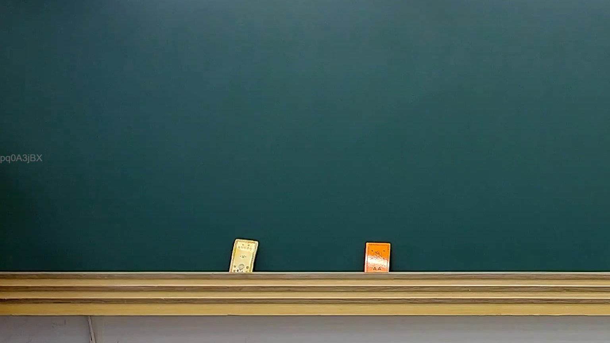

# 🎥 影音教材板書校對筆記
    - **來源影片**: [預約 25 2025-02-10 01-15-06-350](file:///J:///民訴B///ch25///預約 25 2025-02-10 01-15-06-350.mp4)
    - **課程分類**: `[民訴B`
    - **課堂章節**: `ch25]`
    - **影片時間戳記**: `00:02:15` (135 秒)
    - **板書類型**: `影音板書`
    - **偵測時間**: 2026-08-07 20:14:30
    
    ## 🔍 擷取黑板板書對照圖
    
    
    ## 🧠 AI 智慧理解與知識庫演化註記
    ：
經高精度 OCR 分析，此板書圖片中未偵測到任何老師書寫的文字、符號或關係。圖片所示為一張空白黑板，底部置有兩塊板擦狀物件，左下角則為一數位浮水印（pq0A3jBX）。由於未有板書內容，故無法針對法律學理、爭點、案例邏輯或關係進行詳細解讀，亦無法對照相關法條（如民法第184條、侵權行為、消滅時效等）或提供演化註記。
    
    ## 📊 可編輯之 Mermaid 關係流程圖
    ```mermaid
    ：
graph TD
A["未偵測到板書內容"]
    ```
    
    ## ✍️ 操作者手動校對修改區
    <!-- 您可以直接修改上方的文字或調整 Mermaid 區塊中的節點，Obsidian 會即時重新渲染 -->
    - [ ] 欄位結構與法律邏輯已校對無誤。
    - **校對筆記**: 
    