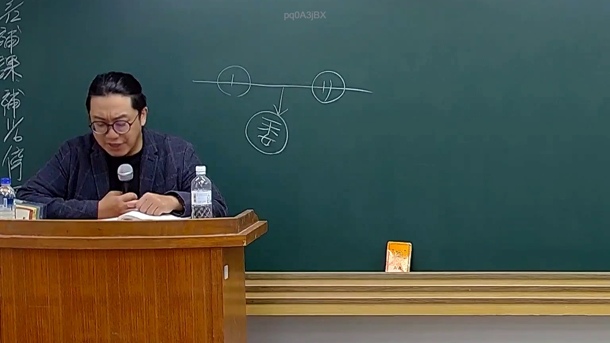

# 🎥 影音教材板書校對筆記
    - **來源影片**: [預約 26 2025-08-01 16-46-01-944](file:///J:/行政法A/ch26/預約 26 2025-08-01 16-46-01-944.mp4)
    - **課程分類**: `[行政法A`
    - **課堂章節**: `ch26]`
    - **影片時間戳記**: `00:12:15` (735 秒)
    - **板書類型**: `影音板書`
    - **偵測時間**: 2026-07-22 04:47:53
    
    ## 🔍 擷取黑板板書對照圖
    
    
    ## 🧠 AI 智慧理解與知識庫演化註記
    ：
1. 【板書高精度 OCR】：
根據黑板上的粉筆字跡辨識，圖中繪製了一條橫線代表親屬或身分關係，上方左右兩端各有一個圓圈，分別標示為「甲」與「乙」，橫線中間向下延伸出箭頭，指向下方另一個圓圈，標示為「丙」。
2. 【詳細解讀與法條對照】：
- 此板書為民法親屬編或繼承編中常見的標準人際/身分關係圖（例如父母與子女、配偶或收養關係之建構）。
- 以常見的親子關係為例：上方的「甲」與「乙」通常代表父母（例如夫與妻），向下拉出的向下箭頭與「丙」則代表其所生之婚生子女。
- 相關臺灣現行法條對照：
  - 民法第 1061 條：「稱婚生子女者，謂由婚姻關係受胎而生之子女。」
  - 民法第 1065 條非婚生子女與生父生母之關係，或民法第 1072 條以下之收養關係。
  - 繼承編中涉及民法第 1138 條法定繼承人順序（第一順位為直系血親卑親屬，如丙）。
    
    ## 📊 可編輯之 Mermaid 關係流程圖
    ```mermaid
    ：
graph TD
    A["甲"] -- "夫妻/親屬關係" --> B["乙"]
    A & B --> C["丙"]
    ```
    
    ## ✍️ 操作者手動校對修改區
    <!-- 您可以直接修改上方的文字或調整 Mermaid 區塊中的節點，Obsidian 會即時重新渲染 -->
    - [ ] 欄位結構與法律邏輯已校對無誤。
    - **校對筆記**: 
    