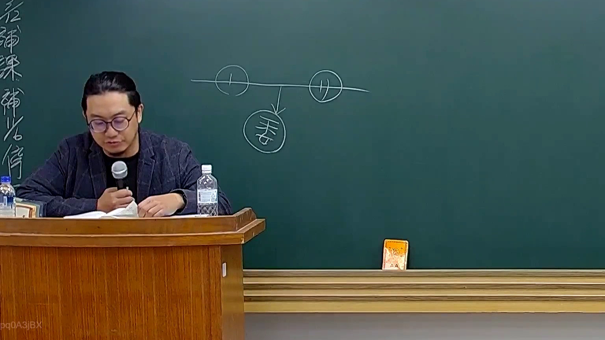

# 🎥 影音教材板書校對筆記
    - **來源影片**: [預約 26 2025-08-01 16-46-01-944](file:///J:/行政法A/ch26/預約 26 2025-08-01 16-46-01-944.mp4)
    - **課程分類**: `[行政法A`
    - **課堂章節**: `ch26]`
    - **影片時間戳記**: `00:13:00` (780 秒)
    - **板書類型**: `影音板書`
    - **偵測時間**: 2026-07-22 04:47:58
    
    ## 🔍 擷取黑板板書對照圖
    
    
    ## 🧠 AI 智慧理解與知識庫演化註記
    ：
1. 【板書高精度 OCR】：
   板書畫面中呈現的是一個親屬法或身分法的標準家系圖結構，包含三個被圓圈包圍的文字符號：
   - 左側圓圈內為：符號「甲」（具體標示為帶有直槓的圓圈，代表男性長輩或父親）。
   - 右側圓圈內為：符號「乙」（具體標示為帶有雙交叉槓的圓圈，代表女性長輩或母親）。
   - 下方中央圓圈內為：漢字「子女」（或代表婚生子女、直系血親卑親屬）。
   - 連結關係：甲與乙之間有一條橫線連接（代表結婚或配偶關係），該橫線往下延伸出一個箭頭指向下方的「子女」（代表親子血親關係）。

2. 【板書詳細解讀與法條對照】：
   - 本圖為臺灣民法親屬編中典型之「直系血親」與「旁系血親」、「配偶」關係的基本圖解架構。
   - 相關法條對照：
     - 依據民法第 967 條：「稱直系血親者，謂己身所從出或從己身所出之血親。稱旁系血親者，謂非直系血親，而與己身出於同源之血親。」圖中甲、乙與下方子女即為直系血親尊親屬與卑親屬的關係。
     - 依據民法第 1061 條（婚生子女之定義）：稱婚生子女者，謂由婚姻關係受胎而生之子女。圖中的橫線（婚姻）與向下箭頭（受胎/出生）精準表達了婚生子女的法律地位與身分推定基礎（參見民法第 1062 條、第 1063 條婚生推定之訴）。
    
    ## 📊 可編輯之 Mermaid 關係流程圖
    ```mermaid
    ：
graph TD
    A["甲 (父)"] --- B["乙 (母)"]
    A --> C["子女"]
    B --> C
    ```
    
    ## ✍️ 操作者手動校對修改區
    <!-- 您可以直接修改上方的文字或調整 Mermaid 區塊中的節點，Obsidian 會即時重新渲染 -->
    - [ ] 欄位結構與法律邏輯已校對無誤。
    - **校對筆記**: 
    