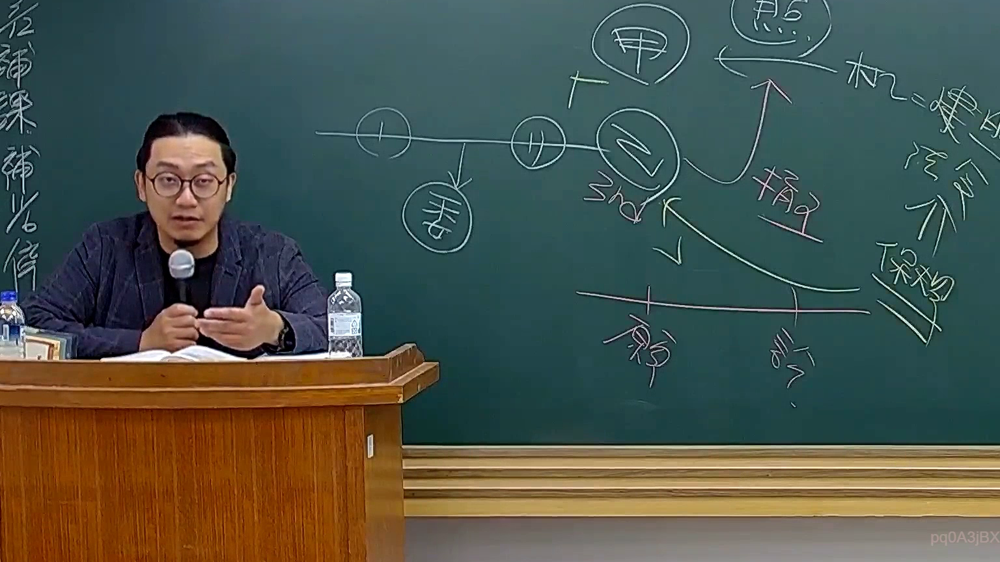

# 🎥 影音教材板書校對筆記
    - **來源影片**: [預約 26 2025-08-01 16-46-01-944](file:///J:/行政法A/ch26/預約 26 2025-08-01 16-46-01-944.mp4)
    - **課程分類**: `[行政法A`
    - **課堂章節**: `ch26]`
    - **影片時間戳記**: `00:22:00` (1320 秒)
    - **板書類型**: `影音板書`
    - **偵測時間**: 2026-07-22 04:48:08
    
    ## 🔍 擷取黑板板書對照圖
    
    
    ## 🧠 AI 智慧理解與知識庫演化註記
    ：
1. 【板書高精度 OCR 辨識結果】：
   - 主體人物下方與右側呈現多個圓圈代號，包含「甲」、「乙」、「丙」、「3rd」、「原」、「訴」等。
   - 時間軸上標示有相關的時間點及箭頭（向下延伸至「委安」或相關受委託人/安全維護者）。
   - 右上方有「利益」、「第三人」、「私法」、「契約」、「保險」等法律概念關鍵字。
   - 包含多組互相交錯的箭頭指向關係，如「損害」賠償請求權之流向、多方主體間的責任歸屬與求償關係。

2. 【板書詳細解讀與法條對照】：
   - 法律學理與案例邏輯：本板書主要在拆解民事法領域中常見的多角關係（Multi-party relations），特別是涉及契約責任與侵權責任之交織、第三人利益契約、或責任保險／代位求償之法律結構。
   - 臺灣現行法條對照：
     - 民法第 184 條（侵權行為）：當主體間發生損害時，關於損害賠償請求權之歸屬與行使。
     - 民法第 269 條（第三人利益契約）：若涉及第三人（3rd）直接取得債權之情形。
     - 保險法第 53 條（保險人代位權）：保險人給付賠償金額後，代位行使被保險人對第三人之損害賠償請求權（對應圖中損害流向與求償箭頭）。
    
    ## 📊 可編輯之 Mermaid 關係流程圖
    ```mermaid
    ：
graph TD
    A["甲"] --> B["乙"]
    B --> C["3rd (第三人)"]
    B --> D["損害賠償"]
    D --> E["原告"]
    D --> F["訴訟"]
    G["保險/契約"] --> B
    ```
    
    ## ✍️ 操作者手動校對修改區
    <!-- 您可以直接修改上方的文字或調整 Mermaid 區塊中的節點，Obsidian 會即時重新渲染 -->
    - [ ] 欄位結構與法律邏輯已校對無誤。
    - **校對筆記**: 
    