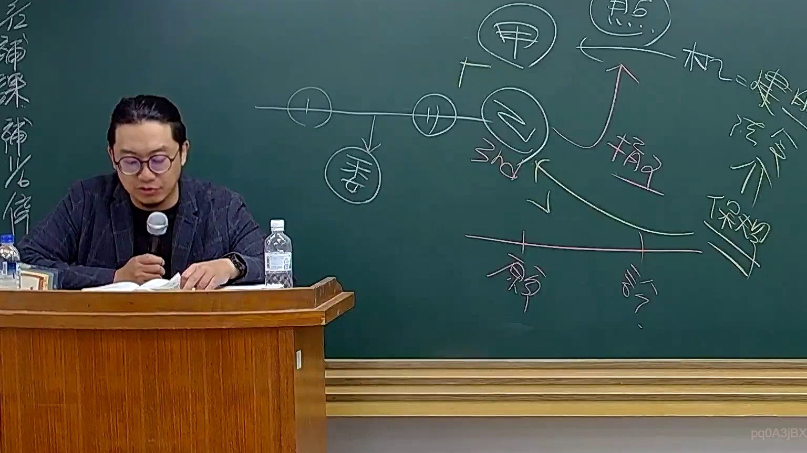

# 🎥 影音教材板書校對筆記
    - **來源影片**: [預約 26 2025-08-01 16-46-01-944](file:///J:/行政法A/ch26/預約 26 2025-08-01 16-46-01-944.mp4)
    - **課程分類**: `[行政法A`
    - **課堂章節**: `ch26]`
    - **影片時間戳記**: `00:22:45` (1365 秒)
    - **板書類型**: `影音板書`
    - **偵測時間**: 2026-07-22 04:48:17
    
    ## 🔍 擷取黑板板書對照圖
    
    
    ## 🧠 AI 智慧理解與知識庫演化註記
    ：
1. 板書文字與符號辨識：
   - 畫面右上方繪有主體「甲」、「乙」，以及時間軸與箭頭關係。
   - 辨識出的文字包含：「甲」、「乙」、「3rd」、「損害」、「原」、「訴訟」、「法令」、「保險」。
   - 圖中呈現一條時間軸，上有時間點標示，並向下延伸出第三人（3rd）與損害賠償的法律關係。

2. 法律學理與爭點對位：
   - 此板書主要在解析民事法學中常見的「多方關係損害賠償請求權」或「保險代位與第三人責任」之法律爭點。
   - 涉及核心條文為《民法》第 184 條（侵權行為責任）及《保險法》第 53 條（保險代位權）。當加害人（乙）對被害人（甲）造成損害，且涉及第三人（3rd）或保險介入時，其請求權競合、訴訟標的及時效起算點（消滅時效）往往成為考試與實務上的重要考點。
    
    ## 📊 可編輯之 Mermaid 關係流程圖
    ```mermaid
    ：
graph TD
    A["甲 (被害人)"] -->|"發生損害"| B["乙 (加害人)"]
    B -->|"衍生責任"| C["3rd (第三人/保險人)"]
    C -->|"保險代位/求償"| A
    D["起訴/訴訟"] -->|"請求權行使"| B
    ```
    
    ## ✍️ 操作者手動校對修改區
    <!-- 您可以直接修改上方的文字或調整 Mermaid 區塊中的節點，Obsidian 會即時重新渲染 -->
    - [ ] 欄位結構與法律邏輯已校對無誤。
    - **校對筆記**: 
    