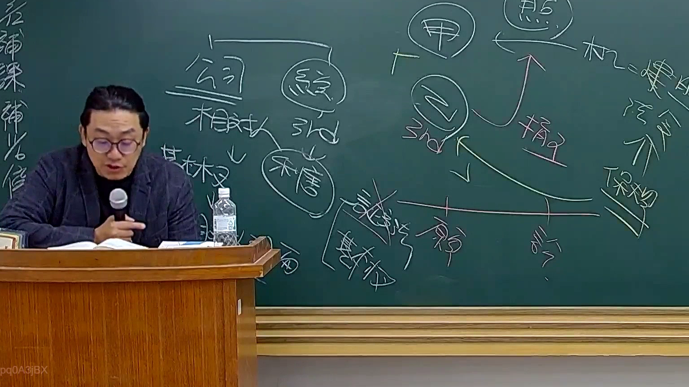

# 🎥 影音教材板書校對筆記
    - **來源影片**: [預約 26 2025-08-01 16-46-01-944](file:///J:/行政法A/ch26/預約 26 2025-08-01 16-46-01-944.mp4)
    - **課程分類**: `[行政法A`
    - **課堂章節**: `ch26]`
    - **影片時間戳記**: `00:27:15` (1635 秒)
    - **板書類型**: `影音板書`
    - **偵測時間**: 2026-07-22 04:48:27
    
    ## 🔍 擷取黑板板書對照圖
    
    
    ## 🧠 AI 智慧理解與知識庫演化註記
    ：
1. 板書文字高精度 OCR 辨識：
   - 左側區塊：公司、經理人、相對人、3rd、私權（私法關係）等。
   - 右側區塊：甲、乙、3rd、損害（以紅字標示）、訴訟、基本權、違法性（違法阻卻事由）、保險等。
   - 中間時間軸與箭頭關係：涉及雙方當事人（甲、乙）與第三人（3rd）之間的損害賠償與基本權干預關係。

2. 詳細法律學理與法條對照：
   - 本板書主要探討私法自治下，公司經理人與相對人、第三人（3rd）之間的法律關係，以及侵權行為與基本權第三人效力（Drittwirkung der Grundrechte）的交織。
   - 相關法律與學理對照：
     * **民法第 184 條（侵權行為責任）**：當公司或其經理人、行為人在執行職務時，若因故意或過失不法侵害他人之權利，應負損害賠償責任。
     * **基本權第三人效力**：憲法基本權原則上規範國家與人民之關係（公法關係），但在私法關係中，透過私法上不確定法律概念（如民法第 184 條第 1 項後段、民法第 72 條公序良俗等），基本權得以「間接」放射效力至私人間的法律關係中（圖中顯示「基本權」、「違法性」的交錯推演）。
     * **損害賠償與保險制度**：透過侵權行為損害賠償架構（如圖中紅字「損害」與時間軸上的訴訟關係），結合保險法理來分擔風險。
    
    ## 📊 可編輯之 Mermaid 關係流程圖
    ```mermaid
    ：
graph TD
    A["公司"] --> B["經理人"]
    A --> C["相對人"]
    B --> D["3rd 第三人"]
    C --> D
    E["甲"] --> F["乙"]
    F -->|"損害"| G["3rd"]
    G --> H["基本權 / 違法性"]
    H --> I["訴訟與保險機制"]
    ```
    
    ## ✍️ 操作者手動校對修改區
    <!-- 您可以直接修改上方的文字或調整 Mermaid 區塊中的節點，Obsidian 會即時重新渲染 -->
    - [ ] 欄位結構與法律邏輯已校對無誤。
    - **校對筆記**: 
    