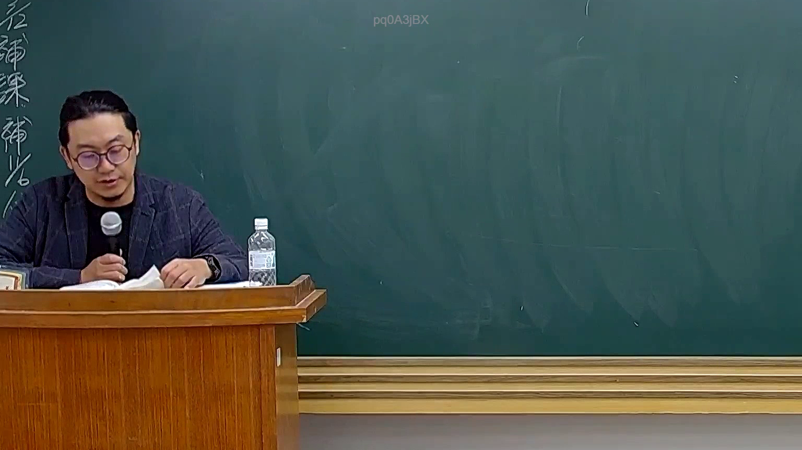

# 🎥 影音教材板書校對筆記
    - **來源影片**: [預約 26 2025-08-01 16-46-01-944](file:///J:/行政法A/ch26/預約 26 2025-08-01 16-46-01-944.mp4)
    - **課程分類**: `[行政法A`
    - **課堂章節**: `ch26]`
    - **影片時間戳記**: `00:35:45` (2145 秒)
    - **板書類型**: `影音板書`
    - **偵測時間**: 2026-07-22 04:48:36
    
    ## 🔍 擷取黑板板書對照圖
    
    
    ## 🧠 AI 智慧理解與知識庫演化註記
    ：
經檢視該影像畫面，黑板上並無針對當前法律課程進行的核心板書書寫，僅在畫面的最左側邊緣保留了零星且部分被截斷的直書字跡（約可辨識為「後補課補...」等行政或課程相關提示字樣），中央大面積黑板則為空白。此時間點老師正低頭閱覽講義並進行口頭講解，未產出具體的法律爭點結構化板書或多方當事人法律關係圖。
    
    ## 📊 可編輯之 Mermaid 關係流程圖
    ```mermaid
    ：
graph TD
    A["目前畫面無核心法律板書"] --> B["老師正進行口頭講授與講義對照"]
    ```
    
    ## ✍️ 操作者手動校對修改區
    <!-- 您可以直接修改上方的文字或調整 Mermaid 區塊中的節點，Obsidian 會即時重新渲染 -->
    - [ ] 欄位結構與法律邏輯已校對無誤。
    - **校對筆記**: 
    