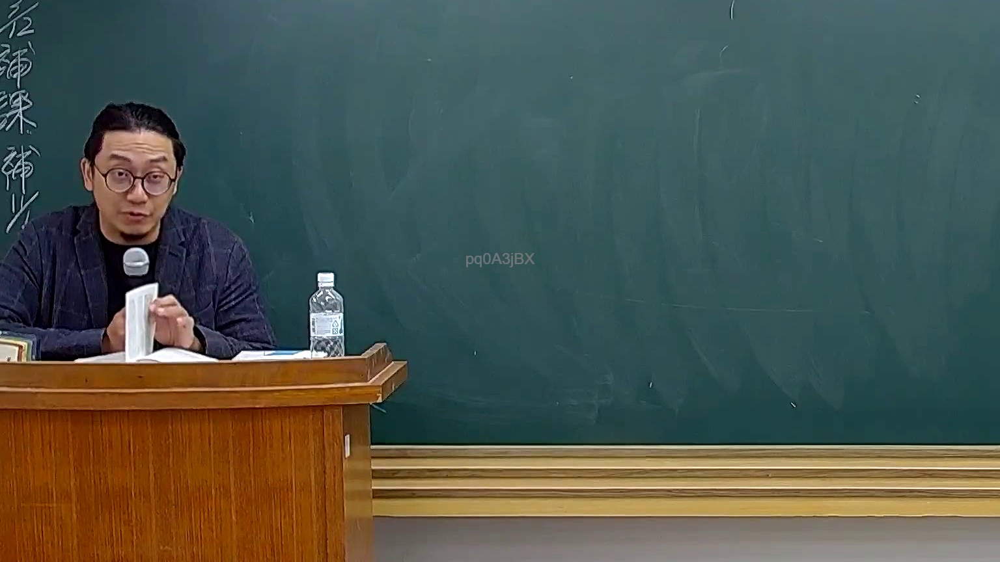

# 🎥 影音教材板書校對筆記
    - **來源影片**: [預約 26 2025-08-01 16-46-01-944](file:///J:/行政法A/ch26/預約 26 2025-08-01 16-46-01-944.mp4)
    - **課程分類**: `[行政法A`
    - **課堂章節**: `ch26]`
    - **影片時間戳記**: `00:37:45` (2265 秒)
    - **板書類型**: `影音板書`
    - **偵測時間**: 2026-07-22 04:48:47
    
    ## 🔍 擷取黑板板書對照圖
    
    
    ## 🧠 AI 智慧理解與知識庫演化註記
    ：
1. 板書文字辨識：畫面左側黑板邊緣僅有零星模糊字跡（如「後補課」、「補課」等標題性質字樣），主板書區域目前為空白狀態，老師正在講台前翻閱教材進行口頭授課或說明，未有新的圖形或法條架構板書呈現。
2. 法律學理與法條對照：由於本畫面正處於口頭講解或翻頁過渡階段，暫無特定之法律爭點或個案架構板書。通常在此類教學情境中，老師會配合現行臺灣民法（如民法總則、債編各論或物權編）或刑法相關條文進行實務見解解析。
    
    ## 📊 可編輯之 Mermaid 關係流程圖
    ```mermaid
    ：
graph TD
    A["老師口頭授課"] --> B["翻閱教材講解"]
    B --> C["等待後續板書補充"]
    ```
    
    ## ✍️ 操作者手動校對修改區
    <!-- 您可以直接修改上方的文字或調整 Mermaid 區塊中的節點，Obsidian 會即時重新渲染 -->
    - [ ] 欄位結構與法律邏輯已校對無誤。
    - **校對筆記**: 
    