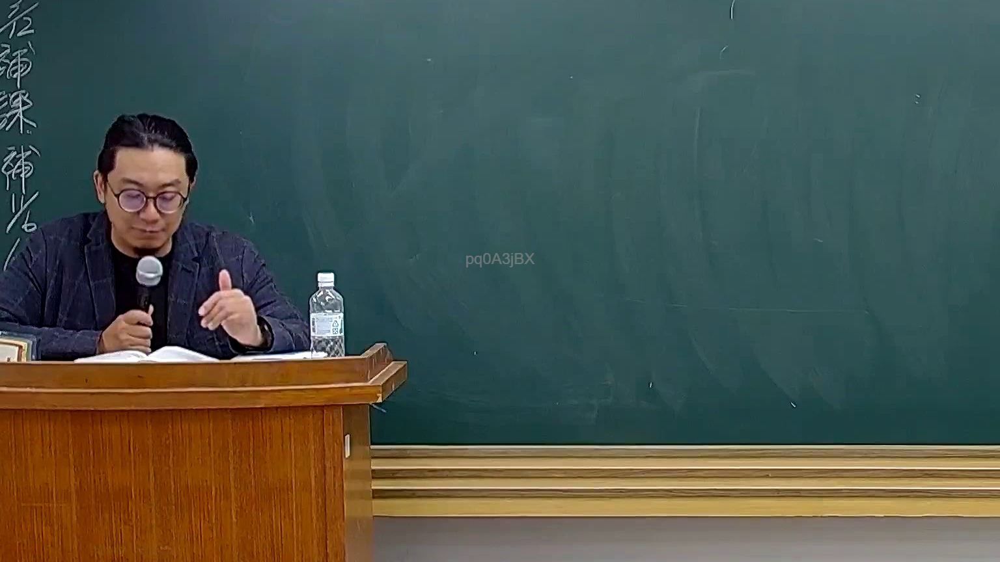

# 🎥 影音教材板書校對筆記
    - **來源影片**: [預約 26 2025-08-01 16-46-01-944](file:///J:/行政法A/ch26/預約 26 2025-08-01 16-46-01-944.mp4)
    - **課程分類**: `[行政法A`
    - **課堂章節**: `ch26]`
    - **影片時間戳記**: `00:39:00` (2340 秒)
    - **板書類型**: `影音板書`
    - **偵測時間**: 2026-07-22 04:49:03
    
    ## 🔍 擷取黑板板書對照圖
    
    
    ## 🧠 AI 智慧理解與知識庫演化註記
    ：
在這張時間點 39分0秒的影像中，黑板上尚未有老師書寫的實質板書內容（僅有左側邊緣殘留少許直書字跡如「補課補」等，右側中央有浮水印）。老師目前正處於口頭講授或講解法學概念的階段。因此，本畫面主要反映教學現場的實況，暫無特定之法律條文結構或爭點圖解可供進行進一步之 OCR 辨識與條文對位。
    
    ## 📊 可編輯之 Mermaid 關係流程圖
    ```mermaid
    ：
graph TD
    A["老師解說中"] --> B["等待板書或案例圖示"]
    ```
    
    ## ✍️ 操作者手動校對修改區
    <!-- 您可以直接修改上方的文字或調整 Mermaid 區塊中的節點，Obsidian 會即時重新渲染 -->
    - [ ] 欄位結構與法律邏輯已校對無誤。
    - **校對筆記**: 
    