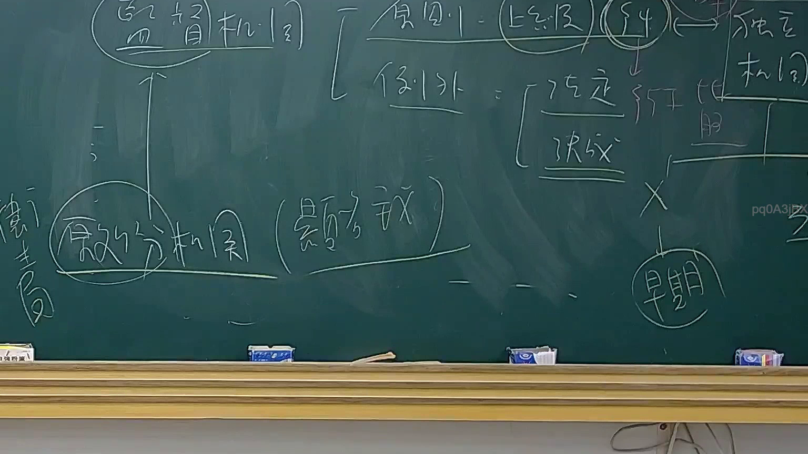

# 🎥 影音教材板書校對筆記
    - **來源影片**: [預約 26 2025-08-01 16-46-01-944](file:///J:/行政法A/ch26/預約 26 2025-08-01 16-46-01-944.mp4)
    - **課程分類**: `[行政法A`
    - **課堂章節**: `ch26]`
    - **影片時間戳記**: `00:41:00` (2460 秒)
    - **板書類型**: `影音板書`
    - **偵測時間**: 2026-07-22 04:49:07
    
    ## 🔍 擷取黑板板書對照圖
    
    
    ## 🧠 AI 智慧理解與知識庫演化註記
    ：
1. 板書高精度 OCR 辨識結果：
   - 頂部與左側：監督機關、原則（上一級）、例外（法定、決成）、獨立機關。
   - 下方：處分機關（顯名主義）。
   - 右側下方：早期。

2. 詳細法律解讀與法條對照：
   - 本板書探討的是行政法或行政訴訟法中關於行政處分的管轄、作成機關、以及「顯名主義」與監督機關、獨立機關的權限關係。
   - 核心概念為「處分機關（顯名主義）」：依據《行政程序法》相關法理，行政處分之作成必須對外表明其為處分機關之意思，即顯名主義，使相對人知悉何者為處分作成機關，以利後續救濟（如訴願及行政訴訟）。
   - 關於管轄與監督機關的關係：原則上由上一級機關監督或處理，例外則有法定或決成（決定成立或特定授權）的規定，並區分一般行政機關與「獨立機關」的權限行使差異。
    
    ## 📊 可編輯之 Mermaid 關係流程圖
    ```mermaid
    ：
graph TD
    A["監督機關"] -->|指揮監督| B["處分機關 (顯名主義)"]
    C["原則 上級機關"] -->|例外 法定/決成| B
    B -->|區分| D["獨立機關"]
    B -->|救濟對象| E["早期/訴願"]
    ```
    
    ## ✍️ 操作者手動校對修改區
    <!-- 您可以直接修改上方的文字或調整 Mermaid 區塊中的節點，Obsidian 會即時重新渲染 -->
    - [ ] 欄位結構與法律邏輯已校對無誤。
    - **校對筆記**: 
    