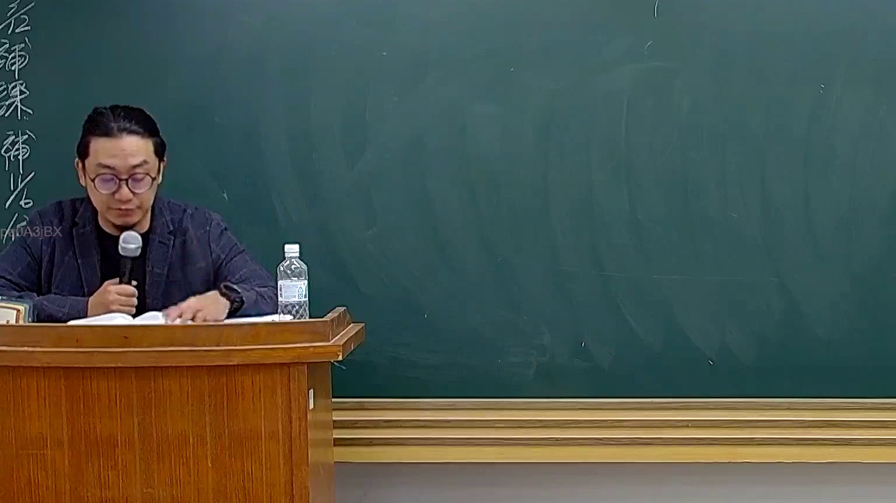

# 🎥 影音教材板書校對筆記
    - **來源影片**: [預約 26 2025-08-01 16-46-01-944](file:///J:/行政法A/ch26/預約 26 2025-08-01 16-46-01-944.mp4)
    - **課程分類**: `[行政法A`
    - **課堂章節**: `ch26]`
    - **影片時間戳記**: `00:44:00` (2640 秒)
    - **板書類型**: `影音板書`
    - **偵測時間**: 2026-07-22 04:49:16
    
    ## 🔍 擷取黑板板書對照圖
    
    
    ## 🧠 AI 智慧理解與知識庫演化註記
    ：
依據圖片顯示，此時間點（44分0秒）黑板上並無新增或明顯的板書內容，僅左側可見部分殘存字跡（如「後補課補考」等行政或課程相關提示文字）。此時老師正低頭翻閱講義與說明教材內容，尚未進行法律概念的體系化板書推演。
    
    ## 📊 可編輯之 Mermaid 關係流程圖
    ```mermaid
    ：
graph TD
    A["課程進行中"] --> B["老師翻閱講義"]
    B --> C["尚未有新板書"]
    ```
    
    ## ✍️ 操作者手動校對修改區
    <!-- 您可以直接修改上方的文字或調整 Mermaid 區塊中的節點，Obsidian 會即時重新渲染 -->
    - [ ] 欄位結構與法律邏輯已校對無誤。
    - **校對筆記**: 
    