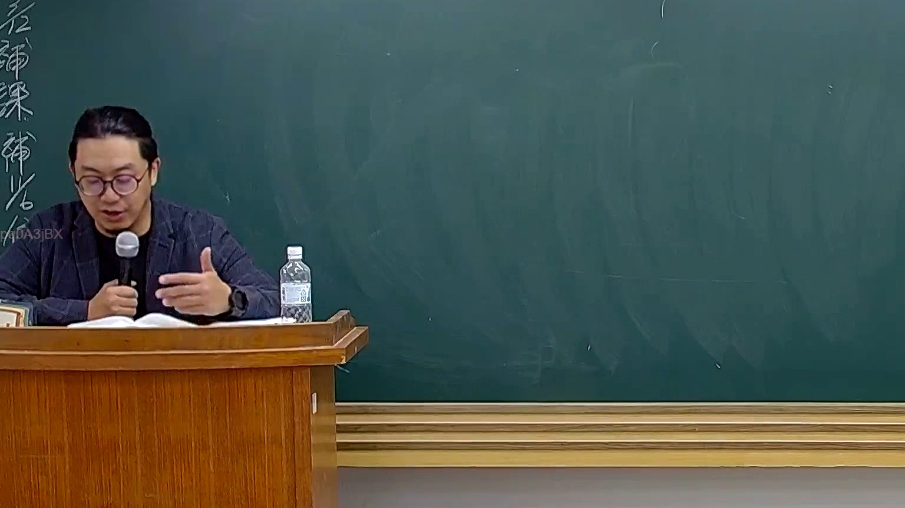

# 🎥 影音教材板書校對筆記
    - **來源影片**: [預約 26 2025-08-01 16-46-01-944](file:///J:/行政法A/ch26/預約 26 2025-08-01 16-46-01-944.mp4)
    - **課程分類**: `[行政法A`
    - **課堂章節**: `ch26]`
    - **影片時間戳記**: `00:44:45` (2685 秒)
    - **板書類型**: `影音板書`
    - **偵測時間**: 2026-07-22 04:49:26
    
    ## 🔍 擷取黑板板書對照圖
    
    
    ## 🧠 AI 智慧理解與知識庫演化註記
    ：
經檢視該影像，畫面中老師正在進行法律授課與講解，黑板上尚未書寫新的板書文字與圖形。左側垂直邊框有部分殘留字跡（如「補課」、「補光」等課程相關浮水印或標示），但主畫面黑板為全空白狀態，並未呈現具體的法律爭點、人際關係結構或法條適用流程。
    
    ## 📊 可編輯之 Mermaid 關係流程圖
    ```mermaid
    ：
graph TD
    A["目前畫面無板書"] --> B["等待老師書寫法律關係與爭點"]
    ```
    
    ## ✍️ 操作者手動校對修改區
    <!-- 您可以直接修改上方的文字或調整 Mermaid 區塊中的節點，Obsidian 會即時重新渲染 -->
    - [ ] 欄位結構與法律邏輯已校對無誤。
    - **校對筆記**: 
    