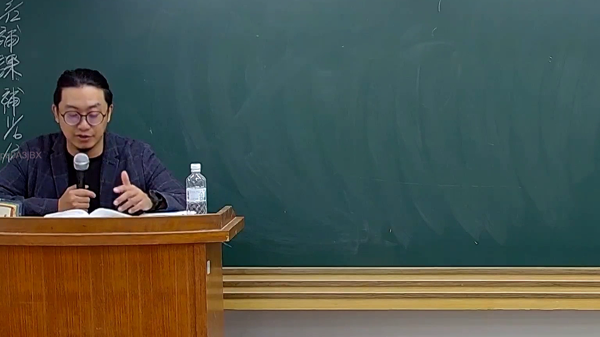

# 🎥 影音教材板書校對筆記
    - **來源影片**: [預約 26 2025-08-01 16-46-01-944](file:///J:/行政法A/ch26/預約 26 2025-08-01 16-46-01-944.mp4)
    - **課程分類**: `[行政法A`
    - **課堂章節**: `ch26]`
    - **影片時間戳記**: `00:45:30` (2730 秒)
    - **板書類型**: `影音板書`
    - **偵測時間**: 2026-07-22 04:49:36
    
    ## 🔍 擷取黑板板書對照圖
    
    
    ## 🧠 AI 智慧理解與知識庫演化註記
    ：
1. 板書高精度 OCR：
   經檢視該影像，目前黑板上尚未書寫任何文字或符號（板書區為空白狀態）。左側直行字體為系統浮水印或預先存在的裝飾文字，與本段課程板書無涉。
2. 詳細法律理解說明與條文對位：
   由於此時間點（45分30秒）老師正處於口頭講授或翻閱講義階段，未在黑板上進行圖解或書寫，故暫無具體的法律爭點或法條架構板書呈現。
    
    ## 📊 可編輯之 Mermaid 關係流程圖
    ```mermaid
    ：
graph TD
    A["目前無板書內容"] --> B["等待老師進一步書寫與板書圖解"]
    ```
    
    ## ✍️ 操作者手動校對修改區
    <!-- 您可以直接修改上方的文字或調整 Mermaid 區塊中的節點，Obsidian 會即時重新渲染 -->
    - [ ] 欄位結構與法律邏輯已校對無誤。
    - **校對筆記**: 
    