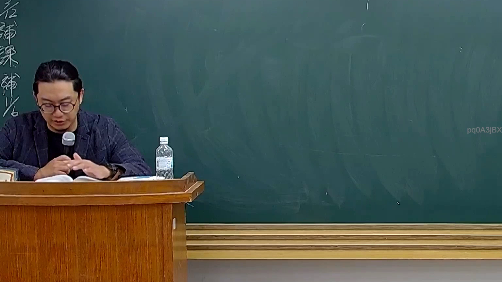

# 🎥 影音教材板書校對筆記
    - **來源影片**: [預約 26 2025-08-01 16-46-01-944](file:///J:/行政法A/ch26/預約 26 2025-08-01 16-46-01-944.mp4)
    - **課程分類**: `[行政法A`
    - **課堂章節**: `ch26]`
    - **影片時間戳記**: `00:51:15` (3075 秒)
    - **板書類型**: `影音板書`
    - **偵測時間**: 2026-07-22 04:49:46
    
    ## 🔍 擷取黑板板書對照圖
    
    
    ## 🧠 AI 智慧理解與知識庫演化註記
    ：
依據畫面所示，此時間點（51分15秒）老師正在講臺前低頭閱讀講義或準備教材，黑板上並未書寫實質的法律板書或圖表。左側邊欄僅有課程相關的殘存字樣（如「後補課」等標示）。因此，本圖目前無具體的法律爭點、實體板書文字或法律關係結構可供進行高精度 OCR 辨識與條文對位。
    
    ## 📊 可編輯之 Mermaid 關係流程圖
    ```mermaid
    ：
graph TD
    A["目前畫面無板書內容"] --> B["等待老師後續板書補充"]
    ```
    
    ## ✍️ 操作者手動校對修改區
    <!-- 您可以直接修改上方的文字或調整 Mermaid 區塊中的節點，Obsidian 會即時重新渲染 -->
    - [ ] 欄位結構與法律邏輯已校對無誤。
    - **校對筆記**: 
    