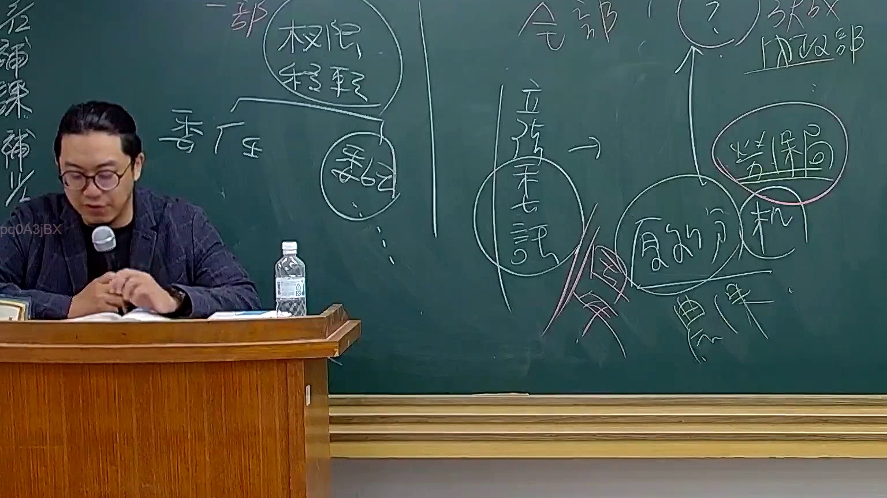

# 🎥 影音教材板書校對筆記
    - **來源影片**: [預約 26 2025-08-01 16-46-01-944](file:///J:/行政法A/ch26/預約 26 2025-08-01 16-46-01-944.mp4)
    - **課程分類**: `[行政法A`
    - **課堂章節**: `ch26]`
    - **影片時間戳記**: `01:00:00` (3600 秒)
    - **板書類型**: `影音板書`
    - **偵測時間**: 2026-07-22 04:49:58
    
    ## 🔍 擷取黑板板書對照圖
    
    
    ## 🧠 AI 智慧理解與知識庫演化註記
    ：
1. 【板書高精度 OCR 辨識結果】：
   - 左半部：「一部」、「權限」、「移轉」、「委任」、「委託」
   - 右半部：「全部」、「？」（指向上方）、內政部、勞保局、「立法未明」、「契約分機/農保」
   
2. 【詳細法律學理與法條對照】：
   - 本板書探討的是行政法學上極為重要的概念：**權限移轉（委任與委託）**與**權限委辦**的區別，以及權限移轉後的法律效果（全部 vs 一部移轉）。
   - **行政程序法第 15 條**規定：「行政機關得將其權限之一部分，委任不屬該機關組織法規定之其他下級機關執行之。」、「行政機關因業務需要，得將其主管之權限，委託不屬於本機關之其他機關或民間團體或個人執行之。」
   - 板書中特別標示「一部」與「全部」的差異，對應到行政法學對於「權限委任」（機關內部或上下級間）與「權限委託」（向外部機關或私人/民間團體，如農保、勞保局相關業務委託）的管轄權移轉範圍界線。
   - 右側出現「內政部」、「勞保局」、「農保」、「契約」等關鍵字，涉及社會保險業務（如農民健康保險、勞工保險）之行政委託或委辦事項，探討當法律未明文規定（立法未明）時，權限能不能移轉、移轉的法律依據與契約性質（公法契約或私法契約）。
    
    ## 📊 可編輯之 Mermaid 關係流程圖
    ```mermaid
    ：
graph TD
    A["權限移轉"] --> B["一部移轉"]
    A --> C["全部移轉"]
    B --> D["委任"]
    B --> E["委託"]
    E --> F["內政部"]
    E --> G["勞保局"]
    F --> H["農保 / 契約"]
    G --> I["立法未明爭點"]
    ```
    
    ## ✍️ 操作者手動校對修改區
    <!-- 您可以直接修改上方的文字或調整 Mermaid 區塊中的節點，Obsidian 會即時重新渲染 -->
    - [ ] 欄位結構與法律邏輯已校對無誤。
    - **校對筆記**: 
    