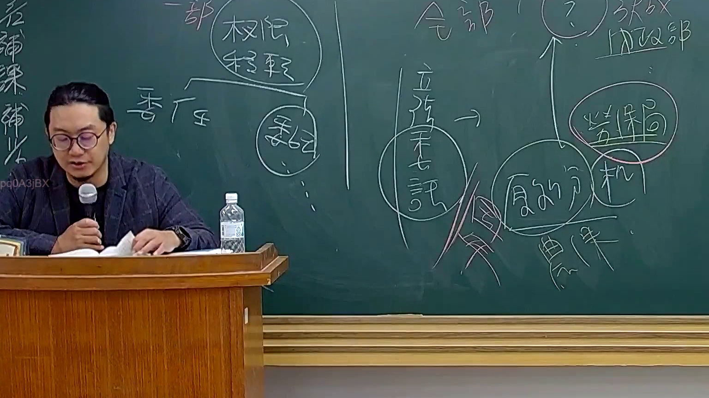

# 🎥 影音教材板書校對筆記
    - **來源影片**: [預約 26 2025-08-01 16-46-01-944](file:///J:/行政法A/ch26/預約 26 2025-08-01 16-46-01-944.mp4)
    - **課程分類**: `[行政法A`
    - **課堂章節**: `ch26]`
    - **影片時間戳記**: `01:07:45` (4065 秒)
    - **板書類型**: `影音板書`
    - **偵測時間**: 2026-07-22 04:50:07
    
    ## 🔍 擷取黑板板書對照圖
    
    
    ## 🧠 AI 智慧理解與知識庫演化註記
    ：
1. 板書文字辨識 (OCR)：
   - 左側與中間區域：「委任」、「委託」、「權限移轉」、「一部」、「全部」、「立法未詳誌」
   - 右側區域：「內政部」、「勞保局」、「履約分擔」、「農保」

2. 法律學理與爭點解析：
   - 本板書探討的是行政法上關於「權限移轉」（如委任與委託）的概念，以及社會保險實務中涉及不同主管機關與執行機關之間的權限劃分與分工。
   - 委任（行政程序法第15條）：指下級機關依法規將其權限之一部，委任所屬下級機關執行。
   - 委託（行政程序法第16條）：指行政機關因業務需要，得依法規將其權限之一部，委託不相隸屬之行政機關執行（或民間團體/個人）。
   - 社會保險體系中（如勞保、農保），常涉及中央主管機關（如內政部、勞動部/衛生福利部等）與執行機關（如勞保局）之間的權限委辦或委任關係，並處理「履約分擔」或全面與部分權限的移轉爭議。
    
    ## 📊 可編輯之 Mermaid 關係流程圖
    ```mermaid
    ：
graph TD
A["行政機關"] -->|"委任/委託"| B["下級機關或不相隸屬機關"]
B -->|"權限移轉"| C["一部或全部執行"]
C --> D["勞保局 / 農保機構"]
D --> E["履約分擔與業務執行"]
    ```
    
    ## ✍️ 操作者手動校對修改區
    <!-- 您可以直接修改上方的文字或調整 Mermaid 區塊中的節點，Obsidian 會即時重新渲染 -->
    - [ ] 欄位結構與法律邏輯已校對無誤。
    - **校對筆記**: 
    