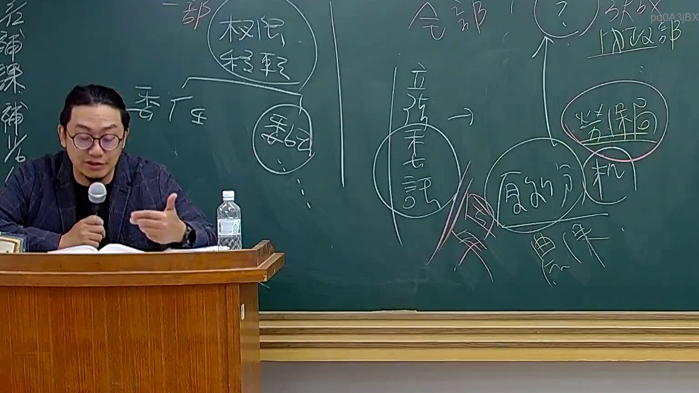

# 🎥 影音教材板書校對筆記
    - **來源影片**: [預約 26 2025-08-01 16-46-01-944](file:///J:/行政法A/ch26/預約 26 2025-08-01 16-46-01-944.mp4)
    - **課程分類**: `[行政法A`
    - **課堂章節**: `ch26]`
    - **影片時間戳記**: `01:09:45` (4185 秒)
    - **板書類型**: `影音板書`
    - **偵測時間**: 2026-07-22 04:50:43
    
    ## 🔍 擷取黑板板書對照圖
    
    
    ## 🧠 AI 智慧理解與知識庫演化註記
    ：

### 一、 板書高精度 OCR 辨識
*   **左側板書內容**：
    *   直書：「管轄權限（恆定）」
    *   圈圈標註：「權限移轉」，其上方寫著「一部」
    *   左下方：「委任」
    *   右下方圈圈：「委託」
*   **右側板書內容**：
    *   上方：「全部」
    *   左側圈圈：「立法者說」
    *   右上方：「內政部」、「？」
    *   右側紅圈：「勞保局」
    *   右側下方圈圈：「處分機關」，其下方寫著「農保」
    *   中間紅色粉筆字：「身分」

---

### 二、 法律學理、爭點與法條對照解說

本板書展示的是台灣行政法學中極為核心的**「管轄恆定原則」**、**「權限移轉之限制（委任與委託）」**，以及實務上著名的**「農保案（勞保局與內政部之權限歸屬與被告身分認定）」**爭點。

#### 1. 管轄恆定原則與權限移轉之「一部限制」
*   **法條對照**：*行政程序法第 11 條第 1 項、第 15 條*
*   **學理邏輯**：
    *   根據**管轄恆定原則**（行政程序法第 11 條），行政機關之管轄權限由法律或法規命令固定之，非依法律不得任意變更。
    *   行政機關若要將管轄權移轉予其他機關，必須有法律保留原則之適用（即板書中的「立法者說/許」）。
    *   更關鍵的是，權限之移轉（包含「委任」與「委託」）**僅限於「一部」（一部分）之移轉，絕對不允許「全部」移轉**。若將權限全部移轉，將導致該行政機關「空殼化」，嚴重違反組織法上之職權分配體制。

#### 2. 委任與委託之區別
*   **法條對照**：*行政程序法第 15 條*
    *   **委任**（第 15 條第 1 項）：指行政機關將其權限之一部分，委任所屬**下級機關**執行。
    *   **委託**（第 15 條第 2 項）：指行政機關因業務上之需要，將其權限之一部分，委託**不相隸屬之行政機關**執行。

#### 3. 實務爭點：農保案之「處分機關」與訴訟「被告身分」認定
*   **實務背景（板書右側架構）**：
    *   依《農民健康保險條例》第 4 條規定，農保之中央主管機關在中央為**內政部**（後改為農業部與內政部共同掌理），而受託辦理業務之保險人為**勞工保險局**。
    *   **爭點（板書中的「？」）**：當農民不服勞工保險局關於農保給付之核定，提起行政訴訟時，究竟應以「委託機關（內政部）」還是「受託機關（勞保局）」為被告？誰才是法律上的「處分機關」？
    *   **解析與結論**：
        *   依行政訴訟法與最高行政法院實務見解（如最高行政法院 97 年 12 月份第 3 次庭長法官聯席會議決議），勞工保險局係受內政部委託辦理農保業務。
        *   因勞工保險局為依法設立之組織，具獨立之編制、預算與印信，屬獨立之行政機關，且其係**以自己名義**對外作成核定處分。
        *   因此，勞保局在法律上即屬「**處分機關**」（具備被告身分），行政訴訟應以「勞工保險局」為被告。這就是板書右側將「勞保局」與「處分機關（農保）」相連，並探討其訴訟「身分」的法理核心。
    
    ## 📊 可編輯之 Mermaid 關係流程圖
    ```mermaid
    ：
graph TD
    A["管轄權限恆定 (行法§11)"] --> B["權限移轉"]
    B --> C["一部移轉 (合法)"]
    B -.-> D["全部移轉 (違法/立法者不許)"]
    
    C --> E["委任 (行法§15 I) <br> 上級機關至下級機關"]
    C --> F["委託 (行法§15 II) <br> 不相隸屬機關之間"]

    subgraph 農保案實務爭點 (被告身分認定)
        G["中央主管機關：內政部"] -- "法律授權委託" --> H["受託機關：勞保局"]
        H -- "以自己名義對外核定" --> I["處分機關"]
        I --> J["行政訴訟之『被告身分』"]
    end
    ```
    
    ## ✍️ 操作者手動校對修改區
    <!-- 您可以直接修改上方的文字或調整 Mermaid 區塊中的節點，Obsidian 會即時重新渲染 -->
    - [ ] 欄位結構與法律邏輯已校對無誤。
    - **校對筆記**: 
    