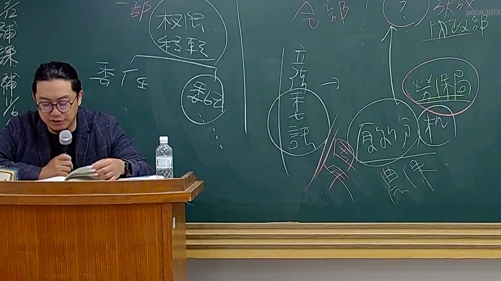

# 🎥 影音教材板書校對筆記
    - **來源影片**: [預約 26 2025-08-01 16-46-01-944](file:///J:/行政法A/ch26/預約 26 2025-08-01 16-46-01-944.mp4)
    - **課程分類**: `[行政法A`
    - **課堂章節**: `ch26]`
    - **影片時間戳記**: `01:10:30` (4230 秒)
    - **板書類型**: `影音板書`
    - **偵測時間**: 2026-07-22 04:51:19
    
    ## 🔍 擷取黑板板書對照圖
    
    
    ## 🧠 AI 智慧理解與知識庫演化註記
    ：

1. 板書高精度 OCR 內容：
   - 畫面左側：一部、權限移轉（圓圈標記）、委任。
   - 畫面中央：垂直分隔線、全部、立法承認（圓圈標記並帶有指向箭頭）。
   - 畫面右側：內政部、勞保局（紅圈標記）、履約、農保、分機（或分支）。

2. 法律學理與爭點解讀：
   本板書的核心在於探討「行政權限之移轉」的法律依據與形式，特別是針對「委任」與「立法承認」的區別：
   - 【一部權限移轉（委任）】：根據《行政程序法》第 15 條，行政機關得將其權限之一部分，委任所屬下級機關執行（委任）或委託不相隸屬之機關（委託）。這僅限於「權限的一部分」，不能將所有權限概括性地移轉。
   - 【全部權限移轉與立法承認】：當涉及某種業務「全部」移轉給不同性質的機關時，通常需要透過「立法承認」。老師在此特別圈出「立法承認」，是用以說明某些行政業務的權限歸屬，雖然在組織法上可能不完全契合，但透過法律（作用法）的特別規定予以承認。
   - 【案例對照 - 勞保局辦理農保】：板書右側提到的「內政部」、「勞保局」與「農保」是臺灣行政法上的經典案例。
     * 早期「農民健康保險」（農保）的主管機關為內政部。
     * 但實際上的業務執行（保險人）則是委託「勞工保險局」（勞保局）辦理。
     * 這種由 A 部會（內政部）的主管事項，由 B 部會所屬機關（當時勞保局隸屬行政院勞委會）來長期執行的模式，在法律性質上涉及了「職務協助」或「行政委託」的爭議。
     * 後來透過《農民健康保險條例》第 4 條明確規定：「農民健康保險由中央主管機關委託勞工保險局辦理」，這便是板書中所指的「立法承認」，透過法律明定來補足程序上的合法性。

3. 法律條文對照：
   - 《行政程序法》第 15 條（委任與委託）。
   - 《行政程序法》第 11 條（權限法定原則）：行政機關之權限均以法律定之，不得隨意變動。
   - 《農民健康保險條例》第 4 條（立法承認之實例）。
    
    ## 📊 可編輯之 Mermaid 關係流程圖
    ```mermaid
    ：
graph TD
    Root["權限移轉方式"] --> Partial["一部移轉 (局部)"]
    Root --> Total["全部移轉 (整體)"]
    
    Partial --> Entrust["委任 / 委託"]
    Entrust --> Law15["行政程序法 §15"]
    
    Total --> LegisAck["立法承認"]
    LegisAck --> Example["案例：農保業務"]
    
    SubGraph1["案例結構"]
    Example --> MOI["主管機關：內政部"]
    Example --> BLI["執行機關：勞保局"]
    MOI -- "法律規定委託辦理" --> BLI
    BLI -- "處理業務" --> Farmer["農保 (農民健康保險)"]
    
    style LegisAck fill#f96,stroke#333,stroke-width2px
    style BLI fill#fdf,stroke#f66,stroke-width2px
    ```
    
    ## ✍️ 操作者手動校對修改區
    <!-- 您可以直接修改上方的文字或調整 Mermaid 區塊中的節點，Obsidian 會即時重新渲染 -->
    - [ ] 欄位結構與法律邏輯已校對無誤。
    - **校對筆記**: 
    