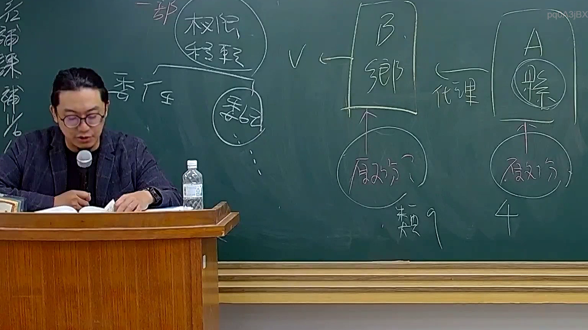

# 🎥 影音教材板書校對筆記
    - **來源影片**: [預約 26 2025-08-01 16-46-01-944](file:///J:/行政法A/ch26/預約 26 2025-08-01 16-46-01-944.mp4)
    - **課程分類**: `[行政法A`
    - **課堂章節**: `ch26]`
    - **影片時間戳記**: `01:22:45` (4965 秒)
    - **板書類型**: `影音板書`
    - **偵測時間**: 2026-07-22 04:52:04
    
    ## 🔍 擷取黑板板書對照圖
    
    
    ## 🧠 AI 智慧理解與知識庫演化註記
    ：
這張板書內容主要聚焦於臺灣「行政法」中，關於**行政權限移轉**與**行政代理**在訴願法上的爭議與管轄權判定。老師透過 A 縣與 B 鄉的關係，說明當行政職權發生變動時，受處分人應向哪一個機關提起訴願。

1. **板書文字辨識 (OCR)**：
   - 左側：一部、權限移轉、委任、委託。
   - 中央偏左：V（打勾符號）、B 鄉（方框標註）。
   - 中央下方：原處分？、類 9（指訴願法第 9 條之類推適用）。
   - 右側：A 縣（「縣」字被圈起）、代理（指向 B 鄉）、原處分、4（指訴願法第 4 條）。

2. **法律學理與條文對照**：
   - **權限移轉（行政程序法第 15 條）**：
     - **委任**：指上級機關將權限移轉給下級機關辦理。依據《訴願法》第 8 條，應向「原委任機關」或其上級機關提起訴願。
     - **委託**：指不相隸屬之機關間權限移轉。依據《訴願法》第 7 條，視同「受委託機關」之處分。
   - **行政代理與訴願管轄**：
     - 板書右側呈現 **A 縣「代理」B 鄉** 的情形。這通常發生在地方自治團體因特殊原因無法執行職務，由上級機關代行或代理時。
     - **原處分機關判定**：當 A 縣代理 B 鄉做出處分，該處分名義上若仍以 B 鄉名義行之，則原處分機關為 B 鄉。
     - **訴願法第 4 條**：規定了訴願管轄的一般原則（例如：不服鄉、鎮、市公所之行政處分者，向縣政府提起訴願）。
     - **「類 9」的演化註記**：老師註記「類 9」，是指在「行政代理」或「代行處分」的情況下，現行法律可能未明文規定管轄，實務或學說上會類推適用《訴願法》第 9 條（關於委辦事項之訴願管轄），以決定應向哪一個機關（通常是代行機關的上級或原委辦機關）提起訴願。

3. **邏輯總結**：
   此板書在釐清「代理」與「權限移轉」的區別。如果是代理，法律效果歸屬於被代理人（B 鄉），但訴願管轄需依《訴願法》第 4 條判斷；若涉及權限委任，則須注意《訴願法》第 7 至 9 條之特殊管轄規定。
    
    ## 📊 可編輯之 Mermaid 關係流程圖
    ```mermaid
    ：
graph TD
    subgraph "權限移轉模式 (行政程序法 §15)"
        T1["一部權限移轉"] --> T2["委任 (上下級)"]
        T1 --> T3["委託 (不相隸屬)"]
    end

    subgraph "代理與管轄爭點"
        A["A 縣"] -- "代理 / 代行" --> B["B 鄉"]
        B --> C["發布原處分"]
        C --> D{"訴願管轄判定"}
        D --> E["訴願法第 4 條 (一般管轄)"]
        D --> F["類推適用訴願法第 9 條"]
    end

    style B fill#f9f,stroke#333,stroke-width2px
    style A fill#bbf,stroke#333,stroke-width2px
    ```
    
    ## ✍️ 操作者手動校對修改區
    <!-- 您可以直接修改上方的文字或調整 Mermaid 區塊中的節點，Obsidian 會即時重新渲染 -->
    - [ ] 欄位結構與法律邏輯已校對無誤。
    - **校對筆記**: 
    