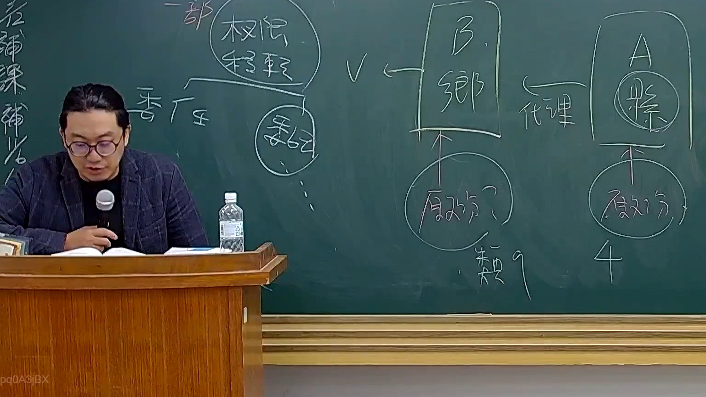

# 🎥 影音教材板書校對筆記
    - **來源影片**: [預約 26 2025-08-01 16-46-01-944](file:///J:/行政法A/ch26/預約 26 2025-08-01 16-46-01-944.mp4)
    - **課程分類**: `[行政法A`
    - **課堂章節**: `ch26]`
    - **影片時間戳記**: `01:28:00` (5280 秒)
    - **板書類型**: `影音板書`
    - **偵測時間**: 2026-07-22 04:52:10
    
    ## 🔍 擷取黑板板書對照圖
    
    
    ## 🧠 AI 智慧理解與知識庫演化註記
    ：
1. **板書內容辨識**：
   - 上方：權限移轉
   - 中間：委任、B（總部/機關）、A（機關）、代理
   - 下方：原處分（指向B）、原處分（指向A）、類9、4
   - 左側：委任

2. **法律學理與爭點**：
   - 本板書探討的是行政法中「權限移轉」的法律結構，特別是「委任」與「代理」的區辨。
   - **權限委任**：指有權限之機關（委任機關），依法將其權限之一部分，委任所屬下級機關或委託不相隸屬之行政機關執行之（行政程序法第15條）。板書中的「委任」指向B機關，意指權限主體發生了移轉。
   - **代理**：指被代理機關因故不能行使職權時，由代理機關代為行使（行政程序法第17條）。板書顯示A與B之間的代理關係，顯示為權限行使的代位，而非權限主體的移轉。
   - **原處分之歸屬**：此為行政爭訟之重要爭點。若為「委任」，則受委任機關（B）以自己名義作成處分，原處分為B所為；若為「代理」，則代理機關（A）係以被代理機關名義為之，原處分仍歸屬於被代理者。

3. **法律對照**：
   - 行政程序法第15條（委任與委託）：探討權限移轉之合法要件。
   - 行政程序法第17條（代理）：探討因故不能行使職權時之代行程序。
   - 行政訴訟法第24條（管轄法院）：因委任或代理導致原處分機關認定不同，進而影響訴訟被告之對象（誰是適格被告）。
    
    ## 📊 可編輯之 Mermaid 關係流程圖
    ```mermaid
    ：
graph TD
    A1["A機關"] -->|代理| B1["B機關"]
    B2["B機關"] -.->|權限移轉| C["委任"]
    D["原處分"] -->|指向| B2
    E["原處分"] -->|指向| A1
    F["權限移轉"] -->|歸類| G["類9"]
    H["代理關係"] -->|歸類| I["4"]
    ```
    
    ## ✍️ 操作者手動校對修改區
    <!-- 您可以直接修改上方的文字或調整 Mermaid 區塊中的節點，Obsidian 會即時重新渲染 -->
    - [ ] 欄位結構與法律邏輯已校對無誤。
    - **校對筆記**: 
    