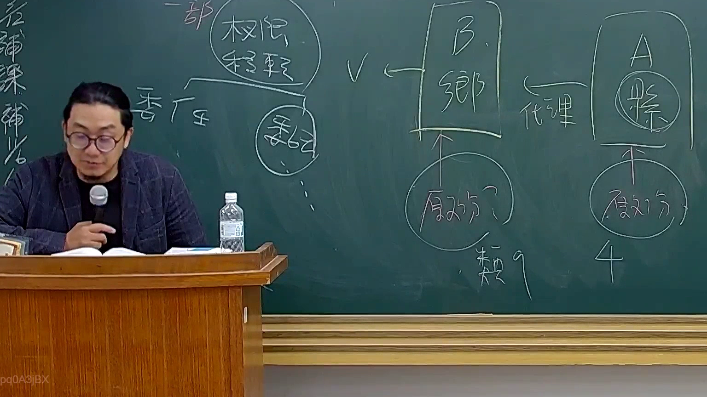

# 🎥 影音教材板書校對筆記
    - **來源影片**: [預約 26 2025-08-01 16-46-01-944](file:///J:/行政法A/ch26/預約 26 2025-08-01 16-46-01-944.mp4)
    - **課程分類**: `[行政法A`
    - **課堂章節**: `ch26]`
    - **影片時間戳記**: `01:28:45` (5325 秒)
    - **板書類型**: `影音板書`
    - **偵測時間**: 2026-07-22 04:52:19
    
    ## 🔍 擷取黑板板書對照圖
    
    
    ## 🧠 AI 智慧理解與知識庫演化註記
    ：
1. 板書文字辨識：
   - 左側：權限移轉、委任（委託）。
   - 右側：B 鄉（行政主體）、代理、A 縣（行政主體）、原處分、原處分。
   - 底部：類 9、4。

2. 法律學理解讀：
   本板書探討的是行政法上的「管轄權移轉」與「行政委託」架構。
   - 核心邏輯：區分「權限移轉」與「委託」的法律效果差異。
   - 法律對照：
     - 依據《行政程序法》第15條與第16條，行政機關得將其權限之一部分，委託不相隸屬之行政機關執行（權限委任/委託），或委託民間團體或個人辦理（行政委託）。
     - 圖中 A 縣與 B 鄉之關係，涉及地方自治團體間的職權分配。若 A 縣將權限「委託」給 B 鄉，則 B 鄉即取得該業務之管轄權，其所做成之行政處分為「原處分」。
     - 區辨爭點：若僅是「委任」（上下級機關間），原處分機關可能不同；若為「委託」（不相隸屬機關），受委託機關即為原處分機關。此邏輯對於後續行政爭訟（訴願法第13條）之被告機關認定至關重要。
    
    ## 📊 可編輯之 Mermaid 關係流程圖
    ```mermaid
    ：
graph LR
    A["A 縣 (權限委託方)"] -- "代理/委託關係" --> B["B 鄉 (受託執行機關)"]
    B -- "發布" --> C["原處分"]
    A -- "發布" --> D["原處分"]
    style B fill#f9f,stroke#333,stroke-width2px
    style A fill#ccf,stroke#333,stroke-width2px
    ```
    
    ## ✍️ 操作者手動校對修改區
    <!-- 您可以直接修改上方的文字或調整 Mermaid 區塊中的節點，Obsidian 會即時重新渲染 -->
    - [ ] 欄位結構與法律邏輯已校對無誤。
    - **校對筆記**: 
    