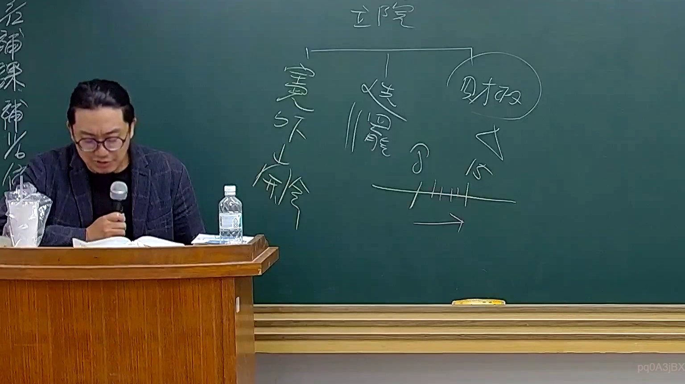

# 🎥 影音教材板書校對筆記
    - **來源影片**: [預約 26 2025-08-01 16-46-01-944](file:///J:/行政法A/ch26/預約 26 2025-08-01 16-46-01-944.mp4)
    - **課程分類**: `[行政法A`
    - **課堂章節**: `ch26]`
    - **影片時間戳記**: `01:46:45` (6405 秒)
    - **板書類型**: `影音板書`
    - **偵測時間**: 2026-07-22 04:52:30
    
    ## 🔍 擷取黑板板書對照圖
    
    
    ## 🧠 AI 智慧理解與知識庫演化註記
    ：

一、板書文字辨識：
1. 頂部主標：「立院」
2. 下方分支：
   - 左側：「憲外餘（憲法外之餘地）」
   - 中間：「法位階」
   - 右側：「財政」
3. 右側下方的時間軸示意：標註了「8」與「15」的數值，下方畫有橫箭頭，代表時間遞延或請求權時效的推演。

二、法律學理與法條對照：
此板書主要探討憲法與立法權運作的層次，並結合財政法規的憲法保留原則。
1. 「立院」作為權力核心，其行使立法權時，必須受到「法位階」理論的拘束（即法律保留原則，中央法規標準法第5條、第6條）。
2. 「憲外餘」：此概念通常指稱憲法未明文規範的領域，依釋字第443號解釋之「層級化法律保留原則」，在該領域中，立法機關的權限劃分與行政機關的授權範圍常成為憲法爭議點。
3. 「財政」：結合「8」與「15」的時間軸，明顯是在討論國家賠償法、公法上請求權或稅捐稽徵法中的「消滅時效」爭點。例如：
   - 國家賠償法第8條：損害賠償請求權之消滅時效（2年/5年）。
   - 稅捐稽徵法第23條：徵收期間（5年，得展延）。
   - 此處數字可能是指某特定法規修正前後的時效變化，或是稅務行政救濟中的特定程序期限（如行政訴訟法第106條之起訴期間）。

三、邏輯歸納：
立法機關（立院）制定的財政法規，必須符合憲法位階的要求，而針對公法上金錢給付請求權，法律通常會設定「8年」或「15年」等不同長度的消滅時效，以維持法安定性，這正是行政法中「法安定性原則」與「權利保障」的權衡。
    
    ## 📊 可編輯之 Mermaid 關係流程圖
    ```mermaid
    ：

graph TD
    A["立院 (立法權)"] --> B["憲外餘地 (憲法邊際)"]
    A --> C["法位階 (法律保留原則)"]
    A --> D["財政 (國家財政權)"]
    D --> E["消滅時效機制"]
    E --> F["8年 (特定請求權期限)"]
    E --> G["15年 (一般公法請求權期限)"]
    F --> H["法律安定性"]
    G --> H
    ```
    
    ## ✍️ 操作者手動校對修改區
    <!-- 您可以直接修改上方的文字或調整 Mermaid 區塊中的節點，Obsidian 會即時重新渲染 -->
    - [ ] 欄位結構與法律邏輯已校對無誤。
    - **校對筆記**: 
    