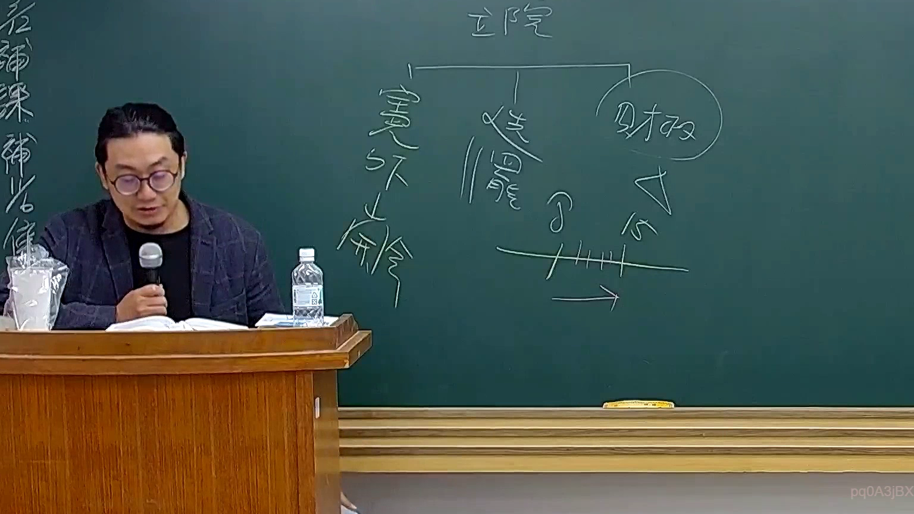

# 🎥 影音教材板書校對筆記
    - **來源影片**: [預約 26 2025-08-01 16-46-01-944](file:///J:/行政法A/ch26/預約 26 2025-08-01 16-46-01-944.mp4)
    - **課程分類**: `[行政法A`
    - **課堂章節**: `ch26]`
    - **影片時間戳記**: `01:49:30` (6570 秒)
    - **板書類型**: `影音板書`
    - **偵測時間**: 2026-07-22 04:52:39
    
    ## 🔍 擷取黑板板書對照圖
    
    
    ## 🧠 AI 智慧理解與知識庫演化註記
    ：
1. **板書文字辨識**：
   - 頂部：立法院
   - 分支：憲法訴訟（憲外之訴）、選舉罷免、財政。
   - 下方符號：時間軸標示「8」與「15」的區間，並有箭頭向右。

2. **法理與爭點說明**：
   - 本板書探討的是立法院的權限範圍與相關爭議之司法救濟途徑。
   - 「憲法訴訟」在此處指稱「憲法法庭」針對法規範憲法審查或機關爭議的職權。
   - 「選舉罷免」涉及《公職人員選舉罷免法》，其訴訟類型（如選舉無效、當選無效之訴）由高等法院管轄，而非行政訴訟。
   - 「財政」涉及預算審查或財政紀律問題。
   - 時間軸「8」與「15」：依據《公職人員選舉罷免法》第126條等規定，選舉罷免訴訟設有較短的除斥期間（如當選無效之訴應於公告當日起15日內提起），此處可能在討論訴訟程序的時效限制與司法審查的門檻。

3. **法律對照**：
   - **憲法訴訟法**：對應立法院通過之法律是否違憲，由憲法法庭審查。
   - **選舉罷免訴訟**：對應《選罷法》第118條以下之規定，具備特殊的時效性，屬於特殊的司法審查機制，目的在於儘速確定選舉結果，保障民主正當性。
    
    ## 📊 可編輯之 Mermaid 關係流程圖
    ```mermaid
    ：
graph TD
    A["立法院"] --> B["憲法訴訟"]
    A --> C["選舉罷免"]
    A --> D["財政"]
    C --> E["訴訟期間限制"]
    E --> F["8-15日除斥期間"]
    ```
    
    ## ✍️ 操作者手動校對修改區
    <!-- 您可以直接修改上方的文字或調整 Mermaid 區塊中的節點，Obsidian 會即時重新渲染 -->
    - [ ] 欄位結構與法律邏輯已校對無誤。
    - **校對筆記**: 
    