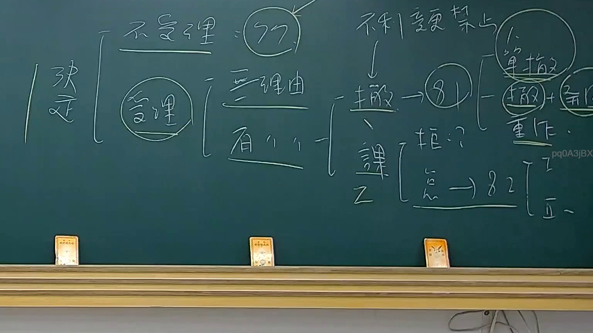

# 🎥 影音教材板書校對筆記
    - **來源影片**: [預約 27 2025-08-02 21-27-54-182](file:///J:/行政法A/ch27/預約 27 2025-08-02 21-27-54-182.mp4)
    - **課程分類**: `[行政法A`
    - **課堂章節**: `ch27]`
    - **影片時間戳記**: `00:16:30` (990 秒)
    - **板書類型**: `影音板書`
    - **偵測時間**: 2026-07-20 23:41:27
    
    ## 🔍 擷取黑板板書對照圖
    
    
    ## 🧠 AI 智慧理解與知識庫演化註記
    ：

此板書呈現的是臺灣《訴願法》中，受理訴願機關做出「訴願決定」的體系分類、審查邏輯與對應法條關係。

1. **決定之程序與實體分類**：
   - 訴願決定首先區分為「程序審查」與「實體審查」。
   - **程序不合法**：做出「不受理」決定，對應【訴願法第77條】（例如逾越訴願期間、訴願人不適格、非行政處分等）。
   - **程序合法（受理）**：受理後進入實體審查，區分為「無理由」與「有理由」。

2. **實體審查結果**：
   - **無理由**：對應【訴願法第79條】，訴願決定應予駁回（維持原處分）。
   - **有理由**：訴願人主張有理，依訴願請求類型不同，分為「撤（撤銷訴願）」與「課（課予義務訴願）」。

3. **撤銷訴願之決定（訴願法第81條）**：
   - 當原處分違法或不當，訴願機關應撤銷原處分。
   - **不利變更禁止原則**：在此路徑中，板書特別標註「不利變更禁止」，即訴願法第81條第1項但書規定：「但於訴願人表示不利益之範圍內，不得為更不利益之變更或處分」，保障訴願人不會因提起救濟反而獲得更不利的結果。
   - **決定效果**：
     - **單撤**：單獨撤銷原處分，不另為處分。
     - **撤 + 另（重作）**：撤銷原處分，並自為決定、逕為變更，或發回原處分機關命其「另為處分」（重作處分）。

4. **課予義務訴願之決定（訴願法第82條）**：
   - 「課」代表課予義務訴願，針對人民依法申請之案件，區分為：
     - **拒（拒絕處分）**：機關做出駁回處分，訴願人請求做出特定處分。
     - **怠（怠為處分）**：機關在法定期間內「不作為」（怠於處分）。
   - **怠為處分之處理（訴願法第82條）**：
     - **Ⅰ（第1項）**：訴願有理由時，訴願機關應指定相當期間，命應作為之機關速為一定之處分。
     - **Ⅱ（第2項）**：若在訴願決定做出前，應作為之機關已為行政處分者，受理訴願機關應認訴願為無理由，以決定駁回之。
    
    ## 📊 可編輯之 Mermaid 關係流程圖
    ```mermaid
    ：
graph TD
    A["訴願決定"] --> B["不受理 (訴願法第77條)"]
    A --> C["受理 (進入實體審查)"]
    
    C --> D["無理由 (訴願法第79條)"]
    C --> E["有理由"]
    
    E --> F["撤銷訴願 (訴願法第81條)"]
    E --> G["課予義務訴願"]
    
    F --> H["不利變更禁止原則"]
    F --> I["單撤 (單獨撤銷)"]
    F --> J["撤銷 + 另為處分 (命原機關重作)"]
    
    G --> K["拒 (拒絕處分)"]
    G --> L["怠 (怠為處分 -> 訴願法第82條)"]
    
    L --> M["Ⅰ (第1項：命速為處分)"]
    L --> N["Ⅱ (第2項：決定前已處分則駁回)"]
    ```
    
    ## ✍️ 操作者手動校對修改區
    <!-- 您可以直接修改上方的文字或調整 Mermaid 區塊中的節點，Obsidian 會即時重新渲染 -->
    - [ ] 欄位結構與法律邏輯已校對無誤。
    - **校對筆記**: 
    