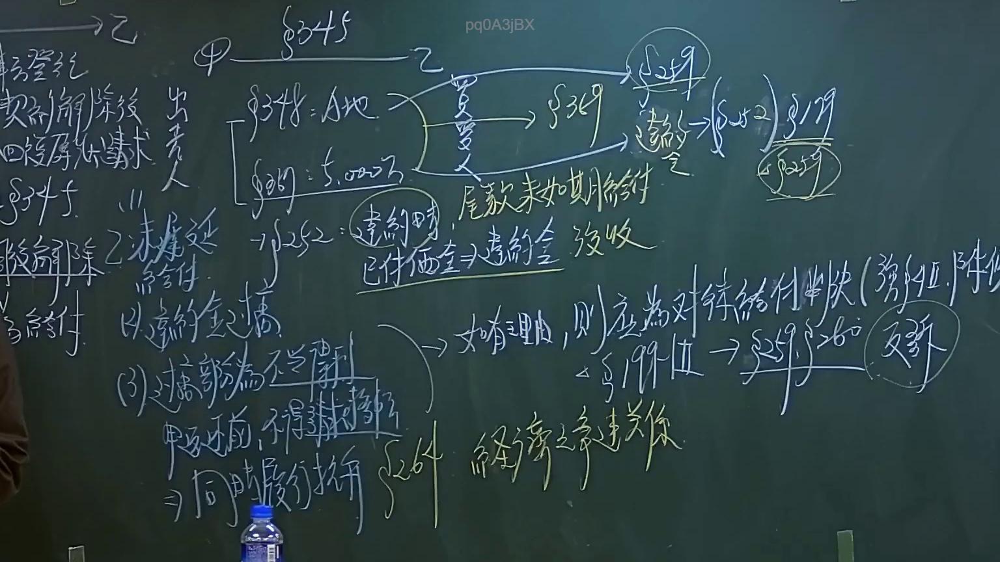

# 🎥 影音教材板書校對筆記
    - **來源影片**: [預約 28 2024-09-28 03-46-24-043](file:///J:///民事訴訟法ˋ///ch28///預約 28 2024-09-28 03-46-24-043.mp4)
    - **課程分類**: `[民事訴訟法ˋ`
    - **課堂章節**: `ch28]`
    - **影片時間戳記**: `00:20:00` (1200 秒)
    - **板書類型**: `影音板書`
    - **偵測時間**: 2026-08-07 20:14:55
    
    ## 🔍 擷取黑板板書對照圖
    
    
    ## 🧠 AI 智慧理解與知識庫演化註記
    ：
這塊板書詳細闡述了臺灣民法上不動產買賣契約中，買方債務不履行（遲延給付尾款）導致契約解除後，所衍生的法律關係與爭議點。

**1. 契約主體與標的：**
*   **甲 (出賣人) → 乙 (買受人)**：甲將 **A地** 出售給乙，價金為 **5,000萬** 元。這是一個不動產買賣契約。
*   **相關法條：**
    *   **民法 §345 (買賣定義)**：買賣者，謂當事人約定一方移轉財產權於他方，他方支付價金之契約。
    *   **民法 §348 (出賣人義務)**：出賣人應負交付其物於買受人，並使其取得該物所有權之義務。此處雖提及「A地」，但§348通常用於動產，不動產則依登記生效。
    *   **民法 §369 (標的物之交付與權利移轉)**：此條文明確指出出賣人應交付標的物並移轉權利，適用於不動產買賣。
*   **「登記」**：不動產物權變動以登記為生效要件。

**2. 買方債務不履行：**
*   **「尾款未如期給付」**：乙未能依約支付最後一筆價款。
*   **「§252 違約時」**：此構成買方債務不履行中的「給付遲延」（民法§229）。§252規定，遲延給付所生之損害，債權人得請求賠償。

**3. 契約解除及其法律效果：**
*   **「契約解除後 出賣請求 回復原狀請求 §259 f.」**：因乙的遲延給付，甲可依民法§254-§256規定，定期催告乙履行，若乙仍不履行，甲可解除契約。契約解除後，雙方當事人均負有回復原狀之義務（民法§259）。
    *   甲：應返還已收取之價金。
    *   乙：應返還A地。
*   **「關於乙之清償遲延 請求給付」**：在解除契約之前，甲也可以先請求乙履行給付義務。

**4. 爭議點：已付價金之處理與違約金：**
*   **「已付價金 ≠ 違約金 沒收」**：這是板書中的一個核心爭議點。意指已付價金不應當然等同於違約金並被沒收。
*   **「違約金 §249」**：若契約中有約定違約金條款，則依民法§249處理。法院可審酌實際損害、當事人經濟狀況等因素，對於過高的違約金，得減至相當之數額（酌減）。
*   **「過部為不當得利 §179」**：若出賣人（甲）所沒收的已付價金，超過了契約約定的有效違約金數額，或在無約定違約金的情況下，超出其因違約所受之損害，則該「過部」（超出部分）構成不當得利（民法§179），甲應將其返還給乙。

**5. 訴訟攻防與防禦：**
*   **「乙 請求返還已付價金」**：在契約解除並回復原狀後，乙有權請求甲返還其已支付的價金。
*   **「甲 同時履行抗辯 §264」**：面對乙請求返還價金，甲可主張同時履行抗辯。依民法§264，當事人之一方得拒絕自己之給付，直至他方為對待給付為止。即甲可主張，乙應先返還A地，甲才返還價金。
*   **「甲反訴, 不得請求」**：這句話可能有多重含義，但結合前後文及同時履行抗辯，可能指：
    *   甲若已援引同時履行抗辯，其在此階段對乙的特定反訴請求可能不被法院支持，因為回復原狀義務是雙向的。
    *   甲的反訴若旨在主張沒收全部已付價金，則在§249酌減與§179不當得利原則下，其請求可能會被部分或全部駁回。
*   **「如有理由, 則應為對待給付 (強制執行) 除去 §199-II」**：這強調了雙方對待給付的原則。如果一方有正當理由要求對方履行（如乙要求返還價金），則另一方（甲）亦可主張其對待給付（返還A地）。「強制執行除去」可能指在執行層面，若一方未履行其對待給付，則另一方得拒絕執行，或請求停止執行。民法§199-II則規定給付應依債之本旨及當事人之意思為之。
*   **「經濟之爭議關係」**：總結此糾紛的本質是一個涉及金錢與財產權的經濟爭議。

綜合來看，板書描繪了不動產買賣違約後解除契約的標準流程，並特別聚焦在已付價金的處理，如何避免過度沒收構成不當得利，以及雙方在回復原狀過程中的權利義務與防禦策略（特別是同時履行抗辯）的應用。
    
    ## 📊 可編輯之 Mermaid 關係流程圖
    ```mermaid
    ：
graph TD
    A["甲 (出賣人)"] -- "簽訂買賣契約" --> C["買賣契約 (A地, 5,000萬, §348, §369)"]
    B["乙 (買受人)"] -- "簽訂買賣契約" --> C

    C -- "義務履行" --> D["乙 尾款未如期給付 (債務不履行 §252 遲延)"]

    D -- "甲行使解除權" --> E["契約解除 (民法 §254-§256)"]

    E -- "產生義務" --> F["回復原狀義務 (民法 §259)"]
    F -- "甲應返還" --> F1["已付價金"]
    F -- "乙應返還" --> F2["A地"]

    D -- "衍生爭議" --> G["已付價金 ≠ 違約金 沒收"]
    G -- "法律適用" --> H["違約金 (約定, 民法 §249)"]
    H -- "若約定過高" --> H1["法院酌減 (§249 II)"]
    G -- "超出部分構成" --> I["不當得利 (民法 §179)"]

    J["乙 請求返還已付價金"] --> K["甲 同時履行抗辯 (民法 §264)"]
    K -- "條件 乙需先" --> F2
    J -- "可能形式為" --> L["反訴 (乙對甲 或 甲反訴範圍受限 '不得請求')"]
    L -- "相關原則" --> M["如有理由, 則應為對待給付 (強制執行除去; 民法 §199-II)"]

    subgraph 爭議焦點與訴訟攻防
        G
        H
        H1
        I
        J
        K
        L
        M
    end

    E -- "總結為" --> N["經濟之爭議關係"]

    style A fill#DDEBF7,stroke#369,stroke-width2px
    style B fill#DDEBF7,stroke#369,stroke-width2px
    style E fill#FFF2CC,stroke#E09C13,stroke-width2px
    style G fill#FFD7D7,stroke#FF0000,stroke-width2px
    style H fill#FFD7D7,stroke#FF0000,stroke-width2px
    style I fill#FFD7D7,stroke#FF0000,stroke-width2px
    style K fill#CCE0FF,stroke#0066CC,stroke-width2px
    style L fill#CCE0FF,stroke#0066CC,stroke-width2px
    style M fill#CCE0FF,stroke#0066CC,stroke-width2px
    ```
    
    ## ✍️ 操作者手動校對修改區
    <!-- 您可以直接修改上方的文字或調整 Mermaid 區塊中的節點，Obsidian 會即時重新渲染 -->
    - [ ] 欄位結構與法律邏輯已校對無誤。
    - **校對筆記**: 
    