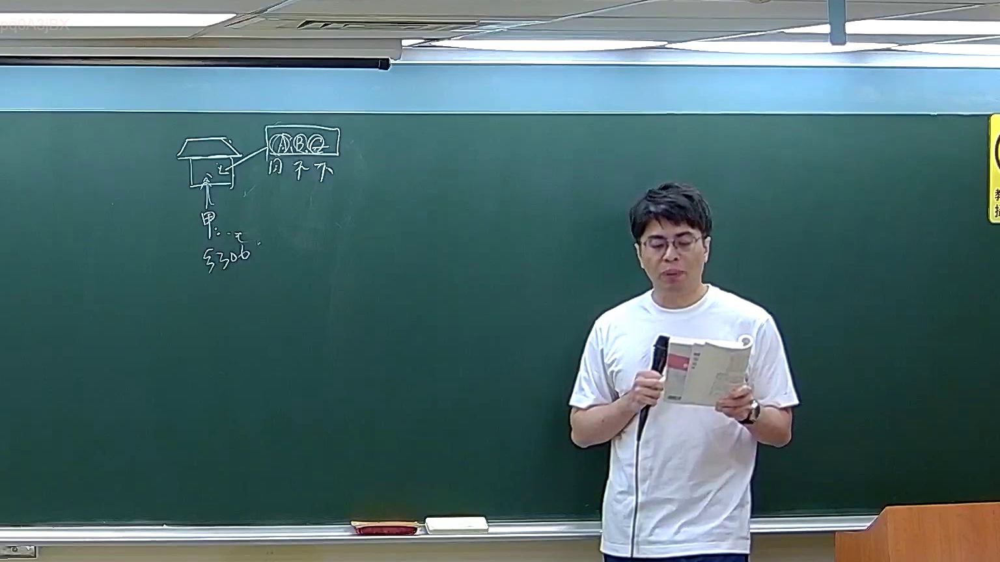

# 🎥 影音教材板書校對筆記
    - **來源影片**: [預約 28 2026-04-24 11-11-39-873](file:///J:/刑法B115/ch28/預約 28 2026-04-24 11-11-39-873.mp4)
    - **課程分類**: `[刑法B115`
    - **課堂章節**: `ch28]`
    - **影片時間戳記**: `00:26:15` (1575 秒)
    - **板書類型**: `影音板書`
    - **偵測時間**: 2026-07-20 17:47:38
    
    ## 🔍 擷取黑板板書對照圖
    
    
    ## 🧠 AI 智慧理解與知識庫演化註記
    ：

一、板書高精度 OCR 辨識
1. 畫面左側繪有一個「房屋」圖示。
2. 房屋內部標示有「乙」（代表該房屋的實際居住者或其中一名成員）。
3. 房屋下方有箭頭指向屋內，箭頭起點為「甲」（代表欲進入房屋之行為人）。
4. 甲的旁邊寫有「甲 ... 乙」，下方則寫有中華民國刑法條文編號「§306」（即刑法第306條侵入住宅罪）。
5. 房屋右上方畫有一個矩形框，框內寫著三個共同居住人「A B C」。
6. 框框下方對應寫著「同 不 不」，代表：
   - 居住人 A 表示「同意」甲進入。
   - 居住人 B 表示「不同意」甲進入。
   - 居住人 C 表示「不同意」甲進入。
7. 從 A 處有一條箭頭指向房屋，代表 A 做出准許甲進入的民事/事實上同意。

二、板書詳細解讀與臺灣法律對照
本板書所展示的是臺灣刑法學界與實務上非常經典的爭點：**「多數居住者意思表示不一致時，行為人進入是否仍構成刑法第306條侵入住宅罪？」**

1. <strong>相關法條對照：</strong>
   * <strong>中華民國刑法第 306 條第 1 項（無故侵入他人住宅罪）：</strong>「無故侵入他人住宅、建築物或附連圍繞之土地或船艦者，處一年以下有期徒刑、拘役或九千元以下罰金。」

2. <strong>法律學理與爭點解析：</strong>
   * <strong>保護客體：</strong> 本罪所保護的法益為「個人居住之安全與隱私」，即居住者對於其私人空間的支配權與平穩權。
   * <strong>案例實況：</strong> 行為人「甲」欲進入某住宅，該住宅由「A、B、C」共同居住。此時 A 同意甲進入（例如 A 是甲的朋友、配偶或合夥人），但同為居住者的 B 與 C 則明確反對（不同意）甲進入。
   * <strong>學說與實務見解之演化：</strong>
     * <strong>否定說（實務常採此見解）：</strong> 居住權、隱私權具有高度個人專屬性，每一位共同居住者均享有獨立且完整的居住支配權。因此，共同居住人中只要有任何一人（如 B、C）不同意，甲的進入即對該不同意之居住者構成侵害。甲不能以獲得 A 之同意作為阻卻違法或阻卻構成要件之理由，故甲仍會成立刑法第 306 條侵入住宅罪。
     * <strong>肯定說（合理使用權限說）：</strong> 認為共同居住人 A 亦享有該住宅的使用權與社交自由。A 邀請其賓客甲進入住宅，屬於 A 合法行使居住權的範疇。在此範圍內，甲的進入具有正當理由，不屬於「無故」，故不應成立本罪。此說強調應衡量各共同居住人間的關係、進入之目的與時間，以判斷是否逾越一般社會通念之合理範圍。
    
    ## 📊 可編輯之 Mermaid 關係流程圖
    ```mermaid
    ：
graph TD
    Jia["行為人 甲"]
    House["房屋 (住宅)"]
    A["共同居住人 A <br>(同意甲進入)"]
    B["共同居住人 B <br>(不同意甲進入)"]
    C["共同居住人 C <br>(不同意甲進入)"]
    Law["刑法第 306 條<br>侵入住宅罪"]

    Jia -->|"欲進入"| House
    A -->|"表示同意"| Jia
    B -->|"表示反對"| Jia
    C -->|"表示反對"| Jia

    House -.->|"共同居住權衝突"| Conflict{"多數居住人<br>意思不一致"}
    Conflict -->|"實務見解<br>(保護個人居住隱私)"| Result1["任一人不同意即屬無故<br>甲成立 §306 侵入住宅罪"]
    Conflict -->|"學說見解之一<br>(考量 A 之社交與使用權)"| Result2["若在合理使用範圍內<br>甲不構成無故侵入"]
    ```
    
    ## ✍️ 操作者手動校對修改區
    <!-- 您可以直接修改上方的文字或調整 Mermaid 區塊中的節點，Obsidian 會即時重新渲染 -->
    - [ ] 欄位結構與法律邏輯已校對無誤。
    - **校對筆記**: 
    