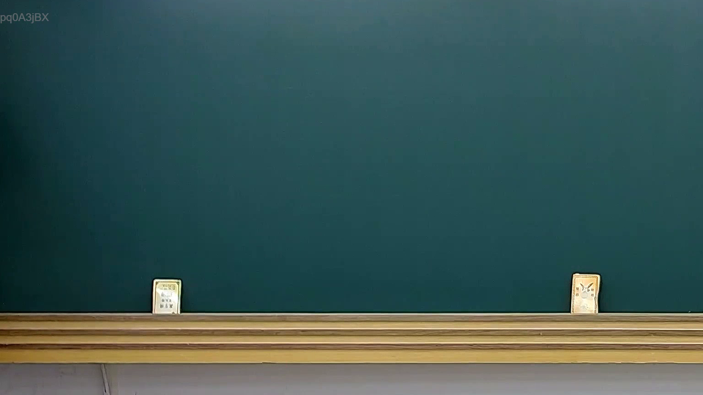

# 🎥 影音教材板書校對筆記
    - **來源影片**: [預約 29 2025-08-05 21-03-24-523](file:///J:/行政法A/ch29/預約 29 2025-08-05 21-03-24-523.mp4)
    - **課程分類**: `[行政法A`
    - **課堂章節**: `ch29]`
    - **影片時間戳記**: `00:00:30` (30 秒)
    - **板書類型**: `影音板書`
    - **偵測時間**: 2026-07-21 01:15:46
    
    ## 🔍 擷取黑板板書對照圖
    
    
    ## 🧠 AI 智慧理解與知識庫演化註記
    ：
經仔細分析影像內容，該圖片為一塊乾淨的黑板，板面中央與兩側均無任何粉筆書寫之文字、符號或邏輯結構。黑板底部設有置物架，架上有兩張疑似小卡片或標示物。

由於板書內容為空白，無法對照具體的法律條文或教學爭點。建議您確認影片播放進度或拍攝之關鍵影格，若後續有老師書寫之板書，請重新提供圖片，我將立即為您進行精確的 OCR 辨識、法律邏輯解讀及 Mermaid 流程圖繪製。
    
    ## 📊 可編輯之 Mermaid 關係流程圖
    ```mermaid
    ：
graph TD
    A["目前畫面無書寫內容，無法繪製邏輯圖"]
    ```
    
    ## ✍️ 操作者手動校對修改區
    <!-- 您可以直接修改上方的文字或調整 Mermaid 區塊中的節點，Obsidian 會即時重新渲染 -->
    - [ ] 欄位結構與法律邏輯已校對無誤。
    - **校對筆記**: 
    