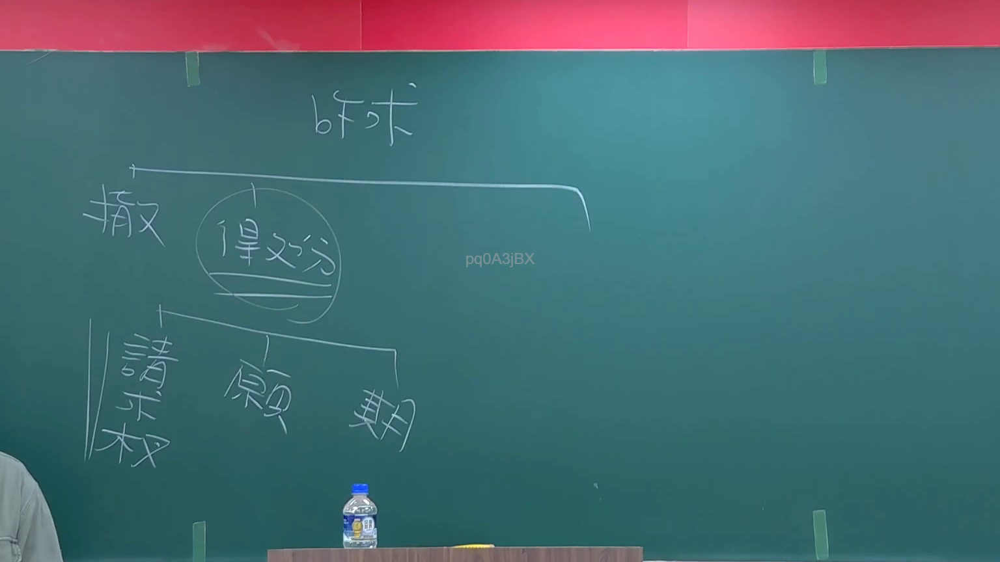

# 🎥 影音教材板書校對筆記
    - **來源影片**: [預約 3 2024-09-03 06-45-06-602](file:///J:/行政法A/ch30/預約 3 2024-09-03 06-45-06-602.mp4)
    - **課程分類**: `[行政法A`
    - **課堂章節**: `ch30]`
    - **影片時間戳記**: `00:05:30` (330 秒)
    - **板書類型**: `影音板書`
    - **偵測時間**: 2026-07-21 01:15:44
    
    ## 🔍 擷取黑板板書對照圖
    
    
    ## 🧠 AI 智慧理解與知識庫演化註記
    ：

1. **OCR 辨識內容**：
   - 頂部：訴求
   - 左側分支：撤（撤銷）
   - 中間圈選處：得處分
   - 下方分支：請求權、願（意願/原因）、期（期限）

2. **法律學理與爭點**：
   本板書呈現的是民法上關於「撤銷權」行使的結構分析。
   - **「訴求」與「撤銷」**：指當事人透過撤銷權的行使，使既存的法律行為歸於無效。這通常與意思表示瑕疵（如民法第88條錯誤、第92條詐欺或脅迫）相關。
   - **「得處分」**：代表該標的物或法律權利，行為人必須具有處分權（或經權利人同意），法律行為方能發生效力，若無處分權則涉及處分行為的效力未定。
   - **「請求權」**：撤銷法律行為後，會產生返還請求權（如民法第114條撤銷後視為自始無效，衍生出民法第179條不當得利返還請求權）。
   - **「願（意願）」**：核心在於確認表意人當時的內心意願是否真實，是否受詐欺或誤認。
   - **「期（期限）」**：強調撤銷權的行使有「除斥期間」限制。例如民法第93條規定，撤銷權應於發現詐欺或脅迫後一年內，或意思表示後十年內為之，逾期權利即消滅。

3. **法律對照與演化註記**：
   - **民法第92條**：因被詐欺或被脅迫而為意思表示者，表意人得撤銷其意思表示。
   - **民法第114條**：法律行為經撤銷者，視為自始無效。
   - **民法第179條**：無法律上原因而受利益，致他人受損害，應返還其利益（撤銷後回復原狀之基礎）。
   - **除斥期間觀念**：與消滅時效不同，除斥期間經過即生權利消滅效果，法院應依職權調查。
    
    ## 📊 可編輯之 Mermaid 關係流程圖
    ```mermaid
    ：

graph TD
    A["訴求"] --> B["撤銷"]
    B --> C("得處分")
    C --> D["請求權"]
    C --> E["願 (意願/意思表示)"]
    C --> F["期 (除斥期間)"]
    ```
    
    ## ✍️ 操作者手動校對修改區
    <!-- 您可以直接修改上方的文字或調整 Mermaid 區塊中的節點，Obsidian 會即時重新渲染 -->
    - [ ] 欄位結構與法律邏輯已校對無誤。
    - **校對筆記**: 
    