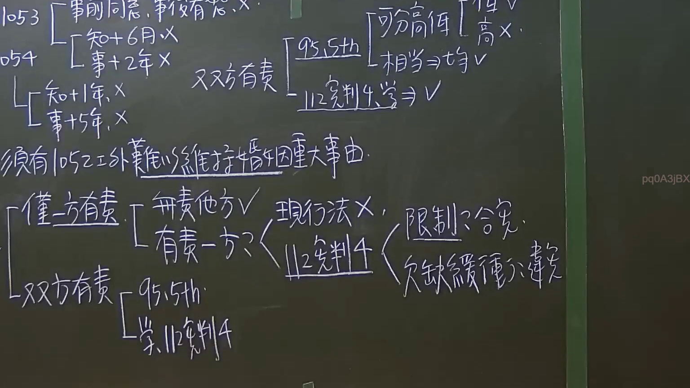

# 🎥 影音教材板書校對筆記
    - **來源影片**: [預約 3 2024-09-21 10-18-43-584](file:///J:/身分法/ch3/預約 3 2024-09-21 10-18-43-584.mp4)
    - **課程分類**: `[身分法`
    - **課堂章節**: `ch3]`
    - **影片時間戳記**: `01:58:30` (7110 秒)
    - **板書類型**: `影音板書`
    - **偵測時間**: 2026-07-19 23:16:46
    
    ## 🔍 擷取黑板板書對照圖
    
    
    ## 🧠 AI 智慧理解與知識庫演化註記
    ：
本板書核心在於探討臺灣《民法》第1052條「裁判離婚」的事由及其限制，特別是針對112年憲判字第4號判決對「有責配偶請求離婚」之規範演進。

1. **消極要件與時效限制（左上角）：**
   - **民法第1053條**：針對第1052條第1項第1、2款（重婚、與人通姦），若有「事前同意」或「事後宥恕」，則不得請求離婚。
   - **民法第1054條**：針對第1052條第1項第6、10款，設有除斥期間。知悉後「6個月」或事實發生後「2年」不行使則消滅。板書下方另列「知+1年、事+5年」係對應其他條款之時效限制。

2. **民法第1052條第2項「重大事由」（破綻主義）：**
   - 法律規定若有第1項以外之「難以維持婚姻之重大事由」，配偶得請求離婚。但「但書」規定：若事由應由配偶之一方負責者，僅他方得請求離婚。

3. **「雙方有責」之判斷演進（中間）：**
   - **最高法院95年度第5次民事庭會議決議**：
     - 若雙方皆有責任，需「比重分析」。
     - 責任較輕（低）者：得請求離婚（V）。
     - 責任較重（高）者：不得請求離婚（X）。
     - 責任相當者：雙方均得請求離婚（V）。
   - **112年憲判字第4號判決修正**：認為不應僅以前述決議判斷，對於雙方有責之情形，朝向承認破綻主義發展（V）。

4. **「僅一方有責」之憲法審查（下方）：**
   - **現行法（1052條2項但書）**：無責他方（V）可告；有責一方（X）原則上不得請求。
   - **112年憲判字第4號判決要旨**：
     - **限制=>合憲**：原則上限制「唯一有責者」請求離婚是為了保護無責方，具正當性。
     - **欠缺緩衝=>違憲**：若婚姻已完全破裂（如長期分居），法律卻一律禁止有責方請求且無任何「緩衝期限」或「例外規定」，則屬違憲。立法者須在兩年內修法，給予有責方在特定條件（如分居多年）下仍有回歸自由之可能。
    
    ## 📊 可編輯之 Mermaid 關係流程圖
    ```mermaid
    ：
graph TD
    A["民法第1052條第2項：重大事由（破綻主義）"] --> B["判斷有責程度"]
    B --> C["僅一方有責"]
    B --> D["雙方均有責"]

    C --> C1["無責他方：得請求離婚 (V)"]
    C --> C2["有責一方：不得請求 (X)"]
    C2 --> C3["112憲判4：絕對禁止違憲"]
    C3 --> C3A["限制本身：原則合憲"]
    C3 --> C3B["欠缺緩衝：過苛違憲 (如長期分居)"]

    D --> D1["95年5次民庭決議"]
    D1 --> D1A["可分高低：低者 V / 高者 X"]
    D1 --> D1B["責任相當：雙方均可 V"]
    D --> D2["112憲判4：肯定雙方均得請求 (V)"]

    E["消極要件限制"] --> E1["1053條：事前同意、事後宥恕"]
    E --> E2["1054條：除斥期間 (6月/2年)"]
    ```
    
    ## ✍️ 操作者手動校對修改區
    <!-- 您可以直接修改上方的文字或調整 Mermaid 區塊中的節點，Obsidian 會即時重新渲染 -->
    - [ ] 欄位結構與法律邏輯已校對無誤。
    - **校對筆記**: 
    