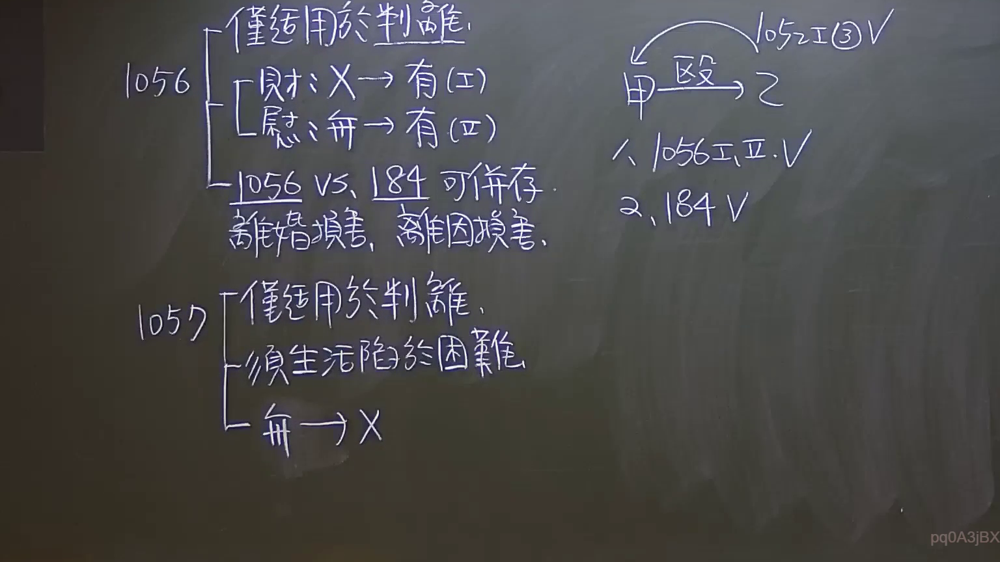

# 🎥 影音教材板書校對筆記
    - **來源影片**: [預約 3 2024-09-21 10-18-43-584](file:///J:/身分法/ch3/預約 3 2024-09-21 10-18-43-584.mp4)
    - **課程分類**: `[身分法`
    - **課堂章節**: `ch3]`
    - **影片時間戳記**: `02:28:30` (8910 秒)
    - **板書類型**: `影音板書`
    - **偵測時間**: 2026-07-19 23:18:01
    
    ## 🔍 擷取黑板板書對照圖
    
    
    ## 🧠 AI 智慧理解與知識庫演化註記
    ：
本板書主要在解析臺灣民法中關於「判決離婚」時的損害賠償（第1056條）與贍養費（第1057條）之請求權要件，以及其與侵權行為（第184條）之關係。

1.  **民法第1056條（損害賠償）：**
    -   **適用前提：** 僅限於「判決離婚」（板書：僅適用於判離）。
    -   **第1項（財產上損害）：** 只要受損害方「無過失」，且他方「有過失」，即可請求財產損害賠償（板書：財：有 -> 有 (Ⅰ)，指他方有過失則有請求權）。
    -   **第2項（非財產上損害/慰撫金）：** 請求權人必須「無過失」，且他方「有過失」為限（板書：慰：無 -> 有 (Ⅱ)，指請求人無過失則有請求權）。
    -   **請求權競合：** 老師強調「1056 vs. 184 可併存」。這裡區分了：
        -   **離因損害：** 導致離婚的原因（如：家暴毆打）所造成的損害，可依民法第184條侵權行為或1056條請求。
        -   **離婚損害：** 契約/身分關係消滅本身所受的損害（如：喪失配偶權益），依1056條請求。

2.  **民法第1057條（贍養費）：**
    -   **適用前提：** 同樣僅適用於「判決離婚」。
    -   **要件：**
        -   請求人必須「無過失」（板書：無 -> 有）。
        -   因判決離婚而「生活陷於困難」。
    -   **性質：** 屬於生活補助性質，非損害賠償。

3.  **案例邏輯分析（右側圖示）：**
    -   **事實：** 甲（過失方）毆打 乙（無過失方）。
    -   **離婚事由：** 乙可依民法第1052條第1項第3款「受他方不堪同居之虐待」請求判決離婚。
    -   **請求權主張：**
        1. 依據 **1056 Ⅰ、Ⅱ** 請求財產及非財產損害（因判決離婚且乙無過失、甲有過失）。
        2. 依據 **184** 請求侵權行為損害賠償（針對毆打行為本身的受傷損害）。

---
    
    ## 📊 可編輯之 Mermaid 關係流程圖
    ```mermaid
    ：
graph TD
    A["甲 (有過失方)"] -- "毆打 (虐待行為)" --> B["乙 (無過失方)"]
    
    subgraph "法律救濟路徑"
    B -- "民法 1052 I ③" --> C["向法院請求判決離婚"]
    C -- "判決離婚確定後" --> D["財產/非財產損害 (1056)"]
    C -- "判決離婚確定後" --> E["贍養費 (1057)"]
    end
    
    B -- "侵權行為請求" --> F["醫藥費/慰撫金 (184)"]
    
    D -.-> G["請求權競合 (可與184併存)"]
    F -.-> G
    
    style E fill#f9f,stroke#333,stroke-width2px
    style G fill#fff4dd,stroke#d4a017,stroke-width2px
    
    text1["1056 區分離婚損害與離因損害"]
    text2["1057 須無過失且生活陷於困難"]
    
    D --- text1
    E --- text2
    ```
    
    ## ✍️ 操作者手動校對修改區
    <!-- 您可以直接修改上方的文字或調整 Mermaid 區塊中的節點，Obsidian 會即時重新渲染 -->
    - [ ] 欄位結構與法律邏輯已校對無誤。
    - **校對筆記**: 
    