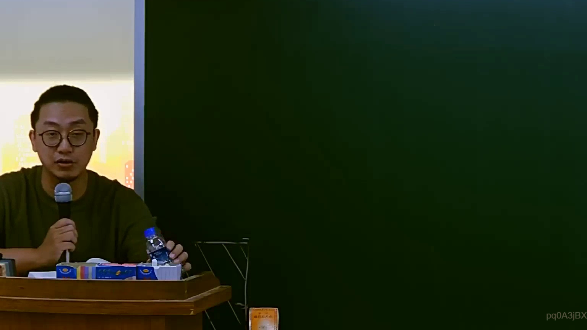

# 🎥 影音教材板書校對筆記
    - **來源影片**: [預約 3 2025-07-22 23-26-20-307](file:///J:/行政法A/ch3/預約 3 2025-07-22 23-26-20-307.mp4)
    - **課程分類**: `[行政法A`
    - **課堂章節**: `ch3]`
    - **影片時間戳記**: `00:12:45` (765 秒)
    - **板書類型**: `影音板書`
    - **偵測時間**: 2026-07-22 04:03:19
    
    ## 🔍 擷取黑板板書對照圖
    
    
    ## 🧠 AI 智慧理解與知識庫演化註記
    ：
經仔細分析影像內容，目前該時間點（12分45秒）的黑板畫面上並無任何文字、符號或繪圖呈現。老師正處於授課講解狀態，尚未開始或暫停板書書寫。因此，無法進行 OCR 辨識或法律關係解讀。

若後續影片中老師開始書寫板書，請提供新的截圖，我將立即為您完成後續的法律分析與 Mermaid 邏輯圖建構。
    
    ## 📊 可編輯之 Mermaid 關係流程圖
    ```mermaid
    ：
graph TD
A["目前畫面無板書內容"]
    ```
    
    ## ✍️ 操作者手動校對修改區
    <!-- 您可以直接修改上方的文字或調整 Mermaid 區塊中的節點，Obsidian 會即時重新渲染 -->
    - [ ] 欄位結構與法律邏輯已校對無誤。
    - **校對筆記**: 
    