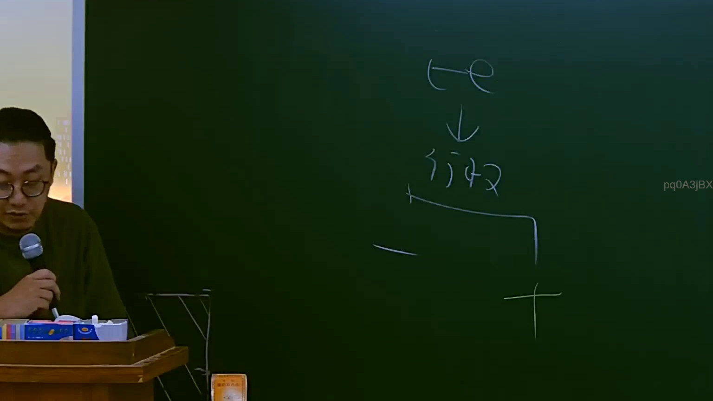

# 🎥 影音教材板書校對筆記
    - **來源影片**: [預約 3 2025-07-22 23-26-20-307](file:///J:/行政法A/ch3/預約 3 2025-07-22 23-26-20-307.mp4)
    - **課程分類**: `[行政法A`
    - **課堂章節**: `ch3]`
    - **影片時間戳記**: `00:37:15` (2235 秒)
    - **板書類型**: `影音板書`
    - **偵測時間**: 2026-07-22 04:03:29
    
    ## 🔍 擷取黑板板書對照圖
    
    
    ## 🧠 AI 智慧理解與知識庫演化註記
    ：
1. **板書辨識內容**：
   - 頂部：te (推測為拉丁文 terminatio 或特定法學縮寫)
   - 下箭頭指向：行政權
   - 下方分岔：一側標示「—」（負面/限制），另一側標示「＋」（正面/賦權）

2. **法學邏輯解析**：
   - 此板書呈現的是行政法中「行政權之雙重屬性」或「行政行為之憲法界限」。
   - **學理對照**：行政權在現代國家不僅是「執行法律」的權力（賦權，＋），同時也必須受到「法律保留原則」與「比例原則」的拘束（限制，—）。
   - **臺灣法律對位**：
     - **行政程序法第4條**：「行政行為應受法律及一般法律原則之拘束。」（體現了對行政權的「限制/—」）。
     - **行政程序法第5條**：「行政行為之內容應明確。」（行政權運作的規範基礎）。
     - **憲法第23條**：法律保留原則，限制人民權利時必須有法律授權（行政權之「限制/—」與「賦權/＋」的界線）。
   - **核心爭點**：行政權的行使如何在法律規範的架構下，兼顧「依法行政（消極面）」與「達成行政目的（積極面/給付行政）」。
    
    ## 📊 可編輯之 Mermaid 關係流程圖
    ```mermaid
    ：
graph TD
    A["te"] --> B["行政權"]
    B --> C["限制 (—)"]
    B --> D["賦權 (+)"]
    C -.-> E["依法行政 / 法律保留"]
    D -.-> F["給付行政 / 行政目的"]
    ```
    
    ## ✍️ 操作者手動校對修改區
    <!-- 您可以直接修改上方的文字或調整 Mermaid 區塊中的節點，Obsidian 會即時重新渲染 -->
    - [ ] 欄位結構與法律邏輯已校對無誤。
    - **校對筆記**: 
    