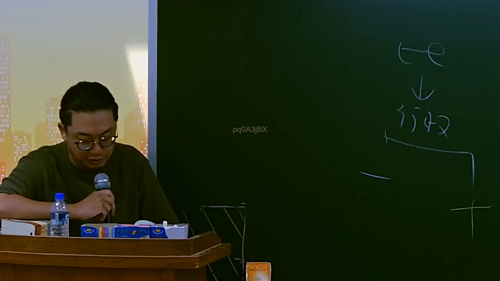

# 🎥 影音教材板書校對筆記
    - **來源影片**: [預約 3 2025-07-22 23-26-20-307](file:///J:/行政法A/ch3/預約 3 2025-07-22 23-26-20-307.mp4)
    - **課程分類**: `[行政法A`
    - **課堂章節**: `ch3]`
    - **影片時間戳記**: `00:56:30` (3390 秒)
    - **板書類型**: `影音板書`
    - **偵測時間**: 2026-07-22 04:03:38
    
    ## 🔍 擷取黑板板書對照圖
    
    
    ## 🧠 AI 智慧理解與知識庫演化註記
    ：
1. 板書文字辨識：
   - 上方文字為「te」（應為法文或相關術語縮寫，意指「體」或「體系」相關概念）。
   - 中間文字為「行為」。
   - 下方引導線指向右側，推測為法律行為之構成要件或後續效果分析。

2. 法律學理與法條對照：
   - 此板書核心在於探討「法律行為」之本質與體系。在臺灣民法中，法律行為（Juristic Act）是權利義務變動的核心動力。
   - 「行為」在民法中主要涉及：
     - 民法第71條至第73條：法律行為之有效要件（適法、確定、可能、方式）。
     - 民法第75條、76條：行為能力與意思表示之健全性。
     - 侵權行為（民法第184條）：若該行為具備不法性且造成損害，則進入損害賠償之債務關係。
   - 此處老師可能正從法律體系（te/體系）切入，先定義法律上的「行為」概念，再展開後續的權利義務解析。
    
    ## 📊 可編輯之 Mermaid 關係流程圖
    ```mermaid
    ：
graph TD
    A["體系(te)"] --> B["行為"]
    B --> C["法律行為要件"]
    B --> D["侵權行為責任"]
    C --> E["適法性"]
    C --> F["行為能力"]
    D --> G["損害賠償"]
    ```
    
    ## ✍️ 操作者手動校對修改區
    <!-- 您可以直接修改上方的文字或調整 Mermaid 區塊中的節點，Obsidian 會即時重新渲染 -->
    - [ ] 欄位結構與法律邏輯已校對無誤。
    - **校對筆記**: 
    