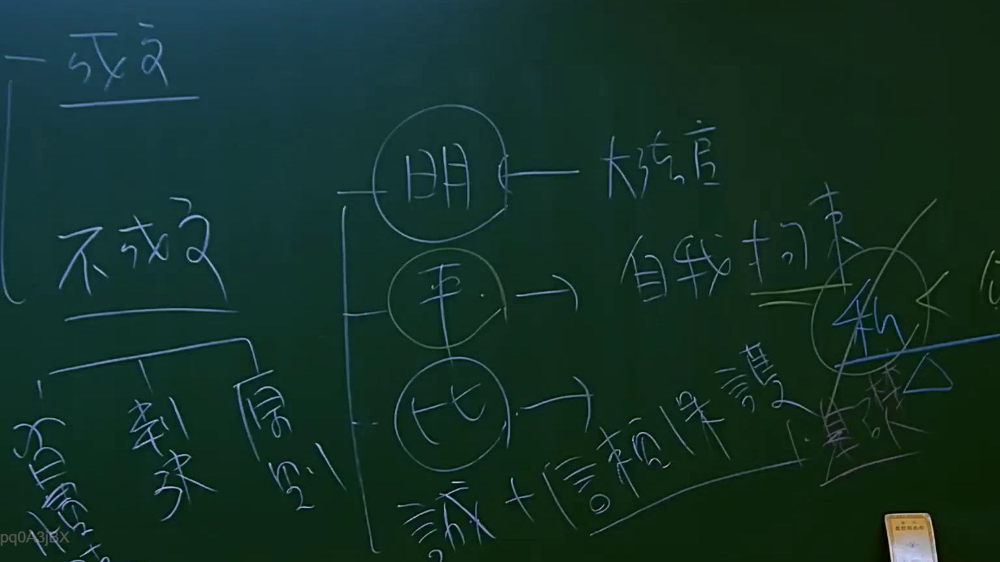

# 🎥 影音教材板書校對筆記
    - **來源影片**: [預約 3 2025-07-22 23-26-20-307](file:///J:/行政法A/ch3/預約 3 2025-07-22 23-26-20-307.mp4)
    - **課程分類**: `[行政法A`
    - **課堂章節**: `ch3]`
    - **影片時間戳記**: `00:59:15` (3555 秒)
    - **板書類型**: `影音板書`
    - **偵測時間**: 2026-07-22 04:03:49
    
    ## 🔍 擷取黑板板書對照圖
    
    
    ## 🧠 AI 智慧理解與知識庫演化註記
    ：

板書內容辨識：
1. 左側：成文法、不成文法。
2. 不成文法下分支：習慣、判決（判例）、原則。
3. 中間圓圈（法律淵源的內涵）：明（明文）、平（平等）、比（比例原則）。
4. 右側邏輯關係：
   - 「明」對應「大法官」。
   - 「平」對應「自我拘束」。
   - 「比」對應「誠＋信賴保護」。
5. 最右側：圈出的「私」字以及相關聯的「公」。

法律學理與法條對照：
- 本板書探討的是法律淵源（Sources of Law），區分「成文法」與「不成文法」。
- 「明」與「大法官」：指涉憲法解釋權，大法官透過釋憲將抽象憲法原則具體化，具有等同法律之效力。
- 「平」與「自我拘束」：對應行政法上之「行政自我拘束原則」（Administrative Self-restraint），即行政機關對於相同或具備本質性差異之案件，應依循先例，不得恣意差別待遇。
- 「比」與「誠＋信賴保護」：這是比例原則（Proportionality Principle）的法理基礎。誠實信用原則（民法第148條第2項）與信賴保護原則（行政程序法第8條）是法治國的核心。
- 「私」與「公」：板書右側出現的圈選，意在界定公法與私法的法理適用範圍，強調公法原則（如比例原則、信賴保護）在私法關係中的間接適用（即透過民法第148條誠信原則引入）。
    
    ## 📊 可編輯之 Mermaid 關係流程圖
    ```mermaid
    ：

graph TD
    A["法律淵源"] --> B["成文法"]
    A --> C["不成文法"]
    C --> D["習慣"]
    C --> E["判決/判例"]
    C --> F["原則"]
    G["明 (明文)"] --> H["大法官"]
    I["平 (平等)"] --> J["自我拘束"]
    K["比 (比例原則)"] --> L["誠實信用 + 信賴保護"]
    M["公法領域"] -.-> N["私法領域"]
    ```
    
    ## ✍️ 操作者手動校對修改區
    <!-- 您可以直接修改上方的文字或調整 Mermaid 區塊中的節點，Obsidian 會即時重新渲染 -->
    - [ ] 欄位結構與法律邏輯已校對無誤。
    - **校對筆記**: 
    