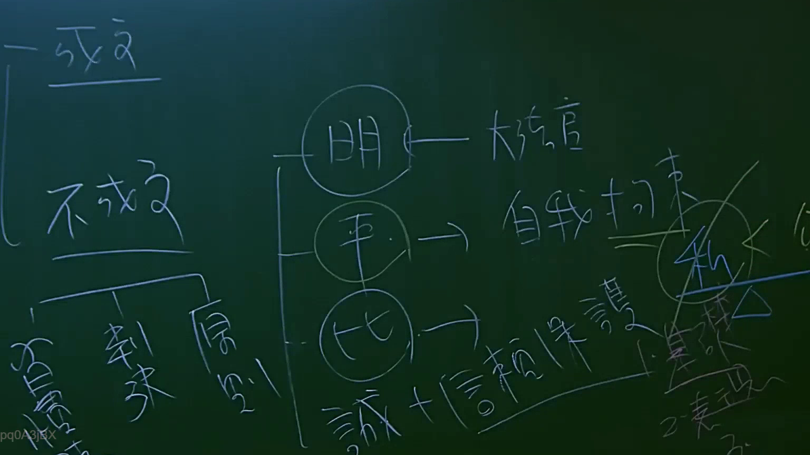

# 🎥 影音教材板書校對筆記
    - **來源影片**: [預約 3 2025-07-22 23-26-20-307](file:///J:/行政法A/ch3/預約 3 2025-07-22 23-26-20-307.mp4)
    - **課程分類**: `[行政法A`
    - **課堂章節**: `ch3]`
    - **影片時間戳記**: `01:00:30` (3630 秒)
    - **板書類型**: `影音板書`
    - **偵測時間**: 2026-07-22 04:03:59
    
    ## 🔍 擷取黑板板書對照圖
    
    
    ## 🧠 AI 智慧理解與知識庫演化註記
    ：

板書內容辨識：
1. 左側：分為「成立」與「不成立」。在「不成立」下方延伸出「習慣」、「判決」、「原則」。
2. 中間：包含三個圓圈分別為「明」、「平」、「比」，並分別對應：
   - 「明」：大法官
   - 「平」：自我拘束
   - 「比」：誠+信賴保護
3. 右側：提到「私」及其下方的「1. 建議」、「2. 表現」。

法律學理與法條對照：
此板書主要在探討法律淵源（法源）的分類，特別是法律解釋與適用原則：
- 成立與不成立：指法律的法源（Source of Law），分為成文法（法律條文）與不成文法（如習慣法、法理、大法官解釋等）。
- 「明、平、比」：這是行政法或法律解釋學中常見的原則簡稱，探討公權力運作的界限：
  - 「明」指明確性原則，透過「大法官」解釋來界定法律構成要件。
  - 「平」指平等原則，行政行為應受「自我拘束原則」（Self-restraint）限制，即行政機關若無正當理由，不得違反過去之行政先例。
  - 「比」指比例原則，同時結合「誠信原則」與「信賴保護原則」（行政程序法第8條）。
- 右側的「私」可能指代「私法自治」或是「公私法區別」。在臺灣法律體系中，這些原則是憲法層次下，行政行為與司法審查的核心基準。
    
    ## 📊 可編輯之 Mermaid 關係流程圖
    ```mermaid
    ：

graph TD
    A["法源"] --> B["成立 (成文法)"]
    A --> C["不成立 (不成文法)"]
    C --> D["習慣"]
    C --> E["判決"]
    C --> F["原則"]
    G["法律適用原則"] --> H["明 (明確性原則)"]
    G --> I["平 (自我拘束原則)"]
    G --> J["比 (比例原則)"]
    H --> K["大法官"]
    I --> L["行政先例一致性"]
    J --> M["誠信與信賴保護"]
    N["私法領域"] --> O["1. 建議"]
    N --> P["2. 表現"]
    ```
    
    ## ✍️ 操作者手動校對修改區
    <!-- 您可以直接修改上方的文字或調整 Mermaid 區塊中的節點，Obsidian 會即時重新渲染 -->
    - [ ] 欄位結構與法律邏輯已校對無誤。
    - **校對筆記**: 
    