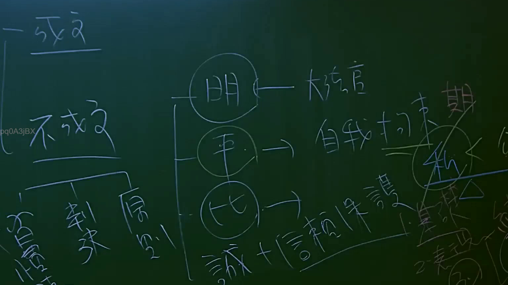

# 🎥 影音教材板書校對筆記
    - **來源影片**: [預約 3 2025-07-22 23-26-20-307](file:///J:/行政法A/ch3/預約 3 2025-07-22 23-26-20-307.mp4)
    - **課程分類**: `[行政法A`
    - **課堂章節**: `ch3]`
    - **影片時間戳記**: `01:07:30` (4050 秒)
    - **板書類型**: `影音板書`
    - **偵測時間**: 2026-07-22 04:04:09
    
    ## 🔍 擷取黑板板書對照圖
    
    
    ## 🧠 AI 智慧理解與知識庫演化註記
    ：

板書內容分析：
1. 【成文/不成文法源】：板書左側區分了「成文」與「不成文」法源。不成文法源下細分了「習慣」、「判決」、「原則」。這是法學緒論中關於「法律淵源」的核心架構。
2. 【司法解釋與憲法】：右側出現「大法官」字樣，並連結至三個圈圈，分別對應「明」、「平」、「比」。
   - 此處應為大法官解釋法律的法理邏輯或解釋方法（或特定學說歸類），連結到「自我拘束」、「誠信+信賴保護」原則。
   - 「自我拘束」係指行政機關或司法機關對於過去的解釋或慣例應予以尊重，以維護法律體系的安定性。
   - 「誠信+信賴保護」原則（憲法層次），對照《行政程序法》第8條、《中央法規標準法》及《司法院釋字第525號、第529號解釋》。
3. 【法律演化註記】：
   - 關於「不成文法」，在我國法律體系中，「習慣」若不違背公共秩序或善良風俗，依《民法》第1條，具有法律效力。
   - 「判決」除具備個案拘束力外，最高法院之「判例」（現多轉化為大法庭裁定）具有事實上的法源地位，確保法律見解的一致性。
   - 提到的「誠信」與「信賴保護」，在民法體系中對應《民法》第148條誠實信用原則；在公法體系則由大法官透過釋字，將信賴保護確立為憲法層次之權利，確保人民對於行政行為或法律狀態的信賴不致受突襲。
    
    ## 📊 可編輯之 Mermaid 關係流程圖
    ```mermaid
    ：

graph TD
    A["法律淵源"] --> B["成文法"]
    A --> C["不成文法"]
    C --> D["習慣"]
    C --> E["判決"]
    C --> F["原則"]
    
    G["大法官解釋"] --> H("明-自我拘束")
    G --> I("平-自我拘束")
    G --> J("比-誠信+信賴保護")
    
    H --> K["自我拘束原則"]
    J --> L["誠信原則"]
    J --> M["信賴保護原則"]
    ```
    
    ## ✍️ 操作者手動校對修改區
    <!-- 您可以直接修改上方的文字或調整 Mermaid 區塊中的節點，Obsidian 會即時重新渲染 -->
    - [ ] 欄位結構與法律邏輯已校對無誤。
    - **校對筆記**: 
    