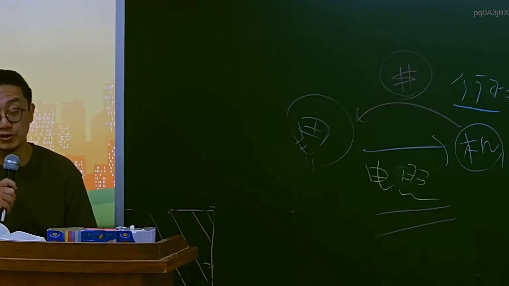

# 🎥 影音教材板書校對筆記
    - **來源影片**: [預約 3 2025-07-22 23-26-20-307](file:///J:/行政法A/ch3/預約 3 2025-07-22 23-26-20-307.mp4)
    - **課程分類**: `[行政法A`
    - **課堂章節**: `ch3]`
    - **影片時間戳記**: `02:07:30` (7650 秒)
    - **板書類型**: `影音板書`
    - **偵測時間**: 2026-07-22 04:04:33
    
    ## 🔍 擷取黑板板書對照圖
    
    
    ## 🧠 AI 智慧理解與知識庫演化註記
    ：
1. 板書文字辨識：
   - 「田」（象徵行為人或特定主體）
   - 「機」（象徵行為客體或特定權利標的，如權利義務之機器/機構）
   - 「#」（象徵財產價值、金錢）
   - 「行為」（上方箭頭所指）
   - 「電照」（下方箭頭所指，推測為「電腦照相」或法律實務上指涉「電磁紀錄」或「電信詐欺」之法律要件呈現）

2. 法律學理與爭點：
   - 該板書以簡易圖示呈現法律行為的構成要素：主體（田）對客體（機）的操作，並透過「行為」與「電照（電磁紀錄）」產生「財產價值（$）」的變動。
   - 結合臺灣刑法實務，此架構常出現於探討「詐欺罪」（刑法第339條）或「妨害電腦使用罪」（刑法第358-360條）之案例。
   - 法律對照：
     - 若涉及以電腦設備不正使用，對照「刑法第339-3條」（以電腦系統詐欺取財罪）。
     - 「電照」在此處可能暗示「電磁紀錄」之證據力或作為詐欺行為之手段。
     - 若涉及侵害財產法益，則對照民法「侵權行為」（民法第184條），即故意或過失不法侵害他人權利，負損害賠償責任。
    
    ## 📊 可編輯之 Mermaid 關係流程圖
    ```mermaid
    ：
graph LR
    A["田(行為人)"] -- "行為" --> B["機(電腦/設備/權利標的)"]
    A -- "電照(電磁紀錄/操作)" --> B
    B -- "產生損益/取得" --> C["#(財產價值/金錢)"]
    ```
    
    ## ✍️ 操作者手動校對修改區
    <!-- 您可以直接修改上方的文字或調整 Mermaid 區塊中的節點，Obsidian 會即時重新渲染 -->
    - [ ] 欄位結構與法律邏輯已校對無誤。
    - **校對筆記**: 
    