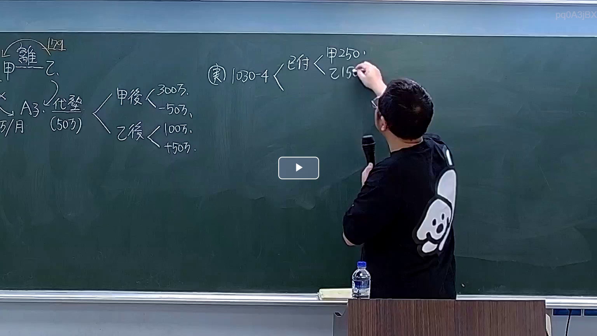

# 🎥 影音教材板書校對筆記
    - **來源影片**: [預約 3 2026-03-09 18-33-20-163](file:///H:/身分法B115/ch3/預約 3 2026-03-09 18-33-20-163.mp4)
    - **課程分類**: `[身分法B115`
    - **課堂章節**: `ch3]`
    - **影片時間戳記**: `02:00:00` (7200 秒)
    - **板書類型**: `影音板書`
    - **偵測時間**: 2026-07-22 03:06:13
    
    ## 🔍 擷取黑板板書對照圖
    
    
    ## 🧠 AI 智慧理解與知識庫演化註記
    ：
1. 板書文字高精度辨識：
   - 左上角：甲、乙（中間標註「離」），上方標記「179」。
   - 左側：A子、5萬/月。下方括號標註「代墊 (50萬)」。
   - 中間：
     * 甲後 < 300萬, -50萬。
     * 乙後 < 100萬, +50萬。
   - 右側（老師書寫中）：(実) 1030-4 < 已付 < 甲 250萬, 乙 150萬。

2. 法律學理與爭點解讀：
   - 核心主題：本板書探討的是「夫妻剩餘財產差額分配請求權」在離婚訴訟中的計算，特別是涉及「代墊撫養費」的歸扣與債權債務抵銷。
   - 民法第1030條之4（剩餘財產計算基準時）：老師特別標註「1030-4」，意指剩餘財產之價值計算，以「判決離婚」應以「起訴時」為準。
   - 代墊撫養費與不當得利（民法第179條）：
     * 圖中「甲」為「A子」代墊了每月5萬、共計50萬的撫養費（可能是分居期間乙未給付的部分）。
     * 在法律實務上，甲對乙擁有「民法第179條不當得利返還請求權」，請求乙返還其應分擔之撫養費。
   - 財產調整邏輯：
     * 甲原本的現存財產（甲後）為300萬，但因這50萬是幫乙墊付的債權，在計算剩餘財產分配時，這50萬的「債權」應從甲的資產中扣除（或視為已實現的支出調整），故計為「250萬」。
     * 乙原本的現存財產（乙後）為100萬，但因其欠甲50萬撫養費（債務），在剩餘財產分配的架構下，需加回或調整其應負擔部分，故計為「150萬」。
   - 實務演化：此處老師正在演示如何將「代墊撫養費之返還」與「剩餘財產分配」掛鉤計算，避免重複列計或漏計，確保最後分配基準（250萬 vs 150萬）的公平性。
    
    ## 📊 可編輯之 Mermaid 關係流程圖
    ```mermaid
    ：
graph TD
A["原告/代墊人 甲"] -- "民法1050/1052 離婚" --- B["被告/應負擔人 乙"]
A -- "照顧與扶養" --> Child["A子 (5萬/月)"]
A -- "支出代墊款 50萬" --> Child
Note["民法第179條 不當得利債權"] -- "甲對乙主張 50萬" --> B

subgraph "民法 1030-4 財產價值計算基準"
    A_Prop["甲現存財產 300萬"] -- "扣除代墊債權調整" --> A_Final["計算基準 250萬"]
    B_Prop["乙現存財產 100萬"] -- "加計應負擔債務調整" --> B_Final["計算基準 150萬"]
end

A_Final -- "差額分配 (1030-1)" --- B_Final
Summary["總分配基礎 (250-150)/2"]
    ```
    
    ## ✍️ 操作者手動校對修改區
    <!-- 您可以直接修改上方的文字或調整 Mermaid 區塊中的節點，Obsidian 會即時重新渲染 -->
    - [ ] 欄位結構與法律邏輯已校對無誤。
    - **校對筆記**: 
    