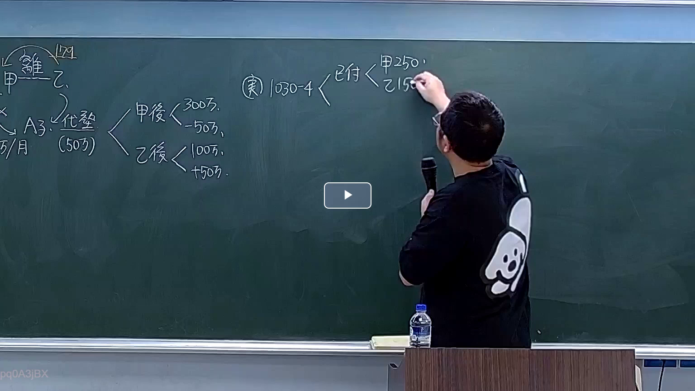

# 🎥 影音教材板書校對筆記
    - **來源影片**: [預約 3 2026-03-09 18-33-20-163](file:///H:/身分法B115/ch3/預約 3 2026-03-09 18-33-20-163.mp4)
    - **課程分類**: `[身分法B115`
    - **課堂章節**: `ch3]`
    - **影片時間戳記**: `02:02:00` (7320 秒)
    - **板書類型**: `影音板書`
    - **偵測時間**: 2026-07-22 03:06:33
    
    ## 🔍 擷取黑板板書對照圖
    
    
    ## 🧠 AI 智慧理解與知識庫演化註記
    ：
在此板書中，老師正在解說「離婚後剩餘財產差額分配」與「代墊扶養費」債權相互影響的計算邏輯。

1. 【板書 OCR 辨識】：
   - 左上角：甲、乙之間標註「離」（離婚），上方有法條註記「179」（民法第179條不當得利）。
   - 關係圖中：出現「A子」，標註「5萬/月」扶養費。有一箭頭指向「代墊(50萬)」。
   - 左方計算式：
     * 甲後：< 300萬, -50萬
     * 乙後：< 100萬, +50萬
   - 右方結論：
     * (庚) 1030-4（民法第1030條之4）
     * 已付：< 甲 250萬, 乙 150萬

2. 【法律詳細解讀與條文對照】：
   - 【代墊扶養費與不當得利】：甲與乙離婚後，關於子女「A子」之扶養義務，本應由父母共同負擔。若甲每月代墊全額扶養費（5萬/月），累積達50萬，則甲對乙擁有「不當得利返還請求權」（民法第179條），因為甲代乙履行了乙應負擔的法律義務。
   - 【剩餘財產分配之評價基準】：右側標註的「1030-4」指民法第1030條之4，規定婚後財產價值的計算，原則上以法定財產制關係消滅時（如起訴離婚日或離婚登記日）為準。
   - 【計算邏輯演化】：
     * 原本甲的婚後財產為300萬，乙為100萬。
     * 但因「代墊扶養費50萬」之事實，在結算剩餘財產時，甲的資產需扣除（或視為已支出/調整），變為250萬。
     * 乙則因為這筆債務的調整（或資產項目的移轉），其結算基數變為150萬。
     * 最終依據民法第1030條之1，雙方現存婚後財產之差額為 250 - 150 = 100萬，由剩餘財產較少的一方（乙）向較多的一方（甲）請求差額的一半（即50萬）。
    
    ## 📊 可編輯之 Mermaid 關係流程圖
    ```mermaid
    ：
graph LR
    A["甲"] -- "離婚" --- B["乙"]
    A -- "代墊扶養費 50萬" --> C["A子"]
    C -. "民法第179條(不當得利)" .-> B
    subgraph "財產結算 (民法 1030-4)"
    D["甲婚後 300萬"] -- "- 50萬" --> E["甲結算 250萬"]
    F["乙婚後 100萬"] -- "+ 50萬" --> G["乙結算 150萬"]
    end
    E -- "計算差額分配" --- G
    ```
    
    ## ✍️ 操作者手動校對修改區
    <!-- 您可以直接修改上方的文字或調整 Mermaid 區塊中的節點，Obsidian 會即時重新渲染 -->
    - [ ] 欄位結構與法律邏輯已校對無誤。
    - **校對筆記**: 
    