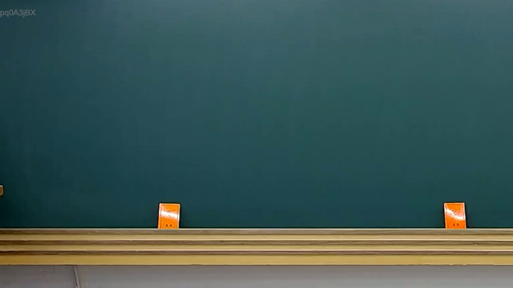

# 🎥 影音教材板書校對筆記
    - **來源影片**: [預約 32 2025-08-06 19-50-49-657](file:///J:/行政法A/ch32/預約 32 2025-08-06 19-50-49-657.mp4)
    - **課程分類**: `[行政法A`
    - **課堂章節**: `ch32]`
    - **影片時間戳記**: `00:00:30` (30 秒)
    - **板書類型**: `關係圖/邏輯圖板書`
    - **偵測時間**: 2026-07-21 01:30:02
    
    ## 🔍 擷取黑板板書對照圖
    
    
    ## 🧠 AI 智慧理解與知識庫演化註記
    ：

您好，您提供的訊息中「擷取區域的 OCR 辨識字元」部分為空白，未實際顯示任何文字內容。因此我無法進行以下工作：

1. **語意整理** — 無辨識字元可供分析
2. **條文比對**（如民法第184條侵權行為、消滅時效等）— 無板書內容可對位
3. **Mermaid 流程圖生成** — 無法從空資料建構邏輯結構

---

請您補充以下任一方式，我即可立即完成分析：

- **方式 A**：將 OCR 辨識出的文字直接貼上（即使有錯字或斷句問題也沒關係）
- **方式 B**：提供截圖檔案，我可自行進行 OCR 辨識後再分析
- **方式 C**：描述老師當時板書的大致內容與邏輯結構

一旦收到實際文字資料，我將立即依您的格式要求輸出及
    
    ## 📊 可編輯之 Mermaid 關係流程圖
    ```mermaid
    。
    ```
    
    ## ✍️ 操作者手動校對修改區
    <!-- 您可以直接修改上方的文字或調整 Mermaid 區塊中的節點，Obsidian 會即時重新渲染 -->
    - [ ] 欄位結構與法律邏輯已校對無誤。
    - **校對筆記**: 
    