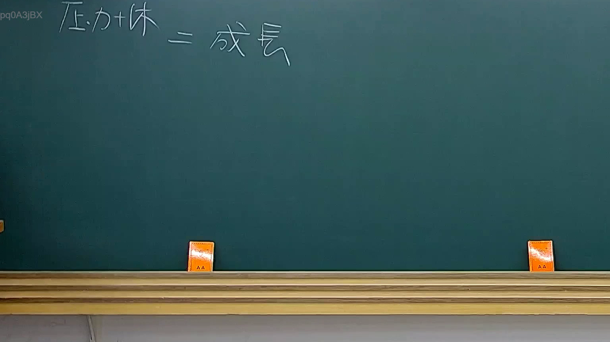

# 🎥 影音教材板書校對筆記
    - **來源影片**: [預約 32 2025-08-06 19-50-49-657](file:///J:/行政法A/ch32/預約 32 2025-08-06 19-50-49-657.mp4)
    - **課程分類**: `[行政法A`
    - **課堂章節**: `ch32]`
    - **影片時間戳記**: `00:01:30` (90 秒)
    - **板書類型**: `關係圖/邏輯圖板書`
    - **偵測時間**: 2026-07-21 01:31:02
    
    ## 🔍 擷取黑板板書對照圖
    
    
    ## 🧠 AI 智慧理解與知識庫演化註記
    ：
您好，您的訊息中「擷取區域的 OCR 辨識字元」部分為空白——在「如下：」之後沒有實際的字串內容。因此我無法對板書文字進行語意整理、條文比對或生成 Mermaid 圖表。

請您補充以下任一方式後我再為您處理：
1. **直接貼上 OCR 辨識出的字元**（例如：「民法第184條...」等）；
2. **描述板書上的文字內容與邏輯關係**，我亦可依此重建分析。

一旦收到文字資料，我會立即完成：
- 語意整理 + 臺灣現行法律條文比對註記（含民法、消滅時效、侵權行為等）；
- Mermaid.js 流程圖代碼（節點用雙引號包裹）。
    
    ## 📊 可編輯之 Mermaid 關係流程圖
    ```mermaid
    graph TD
    A["影音板書"] --> B["尚無關聯關係"]
    ```
    
    ## ✍️ 操作者手動校對修改區
    <!-- 您可以直接修改上方的文字或調整 Mermaid 區塊中的節點，Obsidian 會即時重新渲染 -->
    - [ ] 欄位結構與法律邏輯已校對無誤。
    - **校對筆記**: 
    