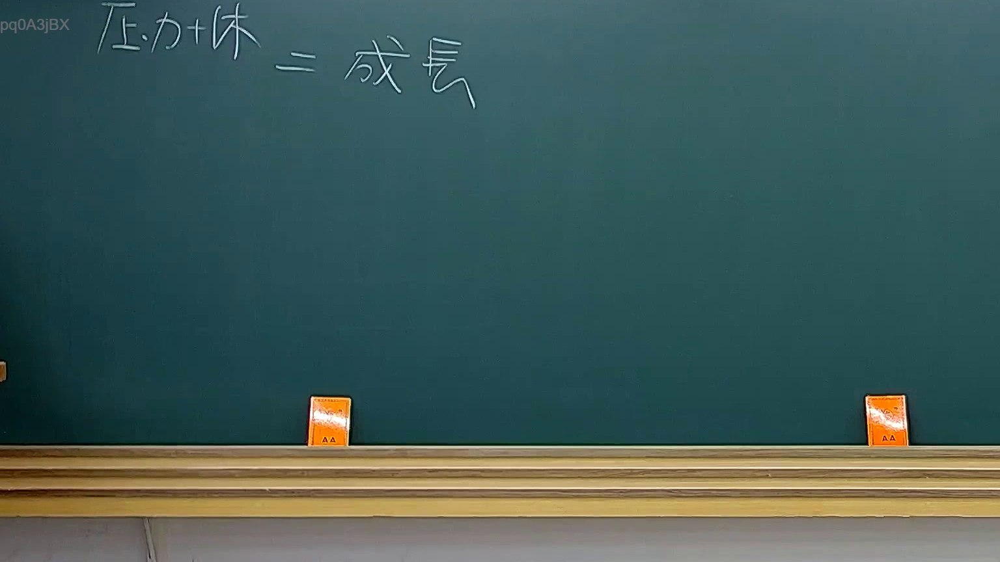

# 🎥 影音教材板書校對筆記
    - **來源影片**: [預約 32 2025-08-06 19-50-49-657](file:///J:/行政法A/ch32/預約 32 2025-08-06 19-50-49-657.mp4)
    - **課程分類**: `[行政法A`
    - **課堂章節**: `ch32]`
    - **影片時間戳記**: `00:02:15` (135 秒)
    - **板書類型**: `關係圖/邏輯圖板書`
    - **偵測時間**: 2026-07-21 01:32:17
    
    ## 🔍 擷取黑板板書對照圖
    
    
    ## 🧠 AI 智慧理解與知識庫演化註記
    ：
您提供的訊息中，「擷取區域的 OCR 辨識字元」部分為空白/未填入實際文字內容。由於缺乏老師板書上的具體文字資訊，我無法進行語意整理、法律條文比對（如民法第184條侵權行為責任、消滅時效等），也無法生成對應的 Mermaid.js 流程圖代碼。

請您補充以下任一方式：
1. **貼上 OCR 辨識出的文字內容**，我將立即為您完成語意整理與法律比對。
2. **描述板書上的邏輯結構或關鍵字**（例如：「原告甲請求被告乙賠償新臺幣100萬元，涉及民法第184條第1項前段」），我亦可依此推演生成 Mermaid 圖表。

一旦您提供文字內容，我會立即執行完整的法律知識庫比對與 Mermaid 代碼生成。
    
    ## 📊 可編輯之 Mermaid 關係流程圖
    ```mermaid
    graph TD
    A["影音板書"] --> B["尚無關聯關係"]
    ```
    
    ## ✍️ 操作者手動校對修改區
    <!-- 您可以直接修改上方的文字或調整 Mermaid 區塊中的節點，Obsidian 會即時重新渲染 -->
    - [ ] 欄位結構與法律邏輯已校對無誤。
    - **校對筆記**: 
    