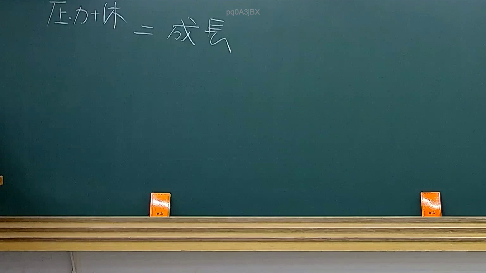

# 🎥 影音教材板書校對筆記
    - **來源影片**: [預約 32 2025-08-06 19-50-49-657](file:///J:/行政法A/ch32/預約 32 2025-08-06 19-50-49-657.mp4)
    - **課程分類**: `[行政法A`
    - **課堂章節**: `ch32]`
    - **影片時間戳記**: `00:03:15` (195 秒)
    - **板書類型**: `關係圖/邏輯圖板書`
    - **偵測時間**: 2026-07-21 01:33:04
    
    ## 🔍 擷取黑板板書對照圖
    
    
    ## 🧠 AI 智慧理解與知識庫演化註記
    ：
您好！您提供的 OCR 辨識字元內容為空白，無法進行後續的法律條文比對與 Mermaid 圖表生成。請將板書上的實際文字重新提供給我，我才能協助完成以下工作：

1. **語意整理** — 針對板書內容進行法律概念梳理
2. **知識庫比對** — 與臺灣現行法條（如民法第184條侵權行為、消滅時效等）進行交叉驗證
3. **Mermaid.js 流程圖生成** — 根據邏輯關係繪製結構化圖表

請補充 OCR 辨識出的文字內容，我將立即為您處理。
    
    ## 📊 可編輯之 Mermaid 關係流程圖
    ```mermaid
    graph TD
    A["影音板書"] --> B["尚無關聯關係"]
    ```
    
    ## ✍️ 操作者手動校對修改區
    <!-- 您可以直接修改上方的文字或調整 Mermaid 區塊中的節點，Obsidian 會即時重新渲染 -->
    - [ ] 欄位結構與法律邏輯已校對無誤。
    - **校對筆記**: 
    