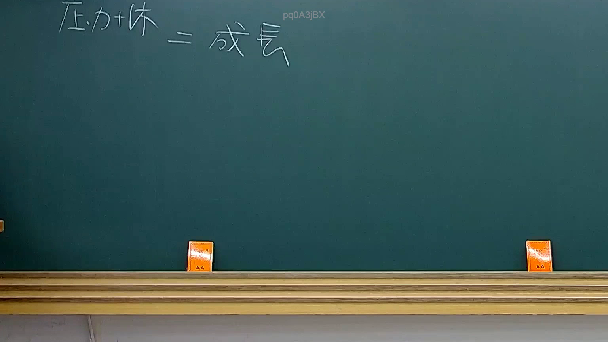

# 🎥 影音教材板書校對筆記
    - **來源影片**: [預約 32 2025-08-06 19-50-49-657](file:///J:/行政法A/ch32/預約 32 2025-08-06 19-50-49-657.mp4)
    - **課程分類**: `[行政法A`
    - **課堂章節**: `ch32]`
    - **影片時間戳記**: `00:04:15` (255 秒)
    - **板書類型**: `關係圖/邏輯圖板書`
    - **偵測時間**: 2026-07-21 01:34:27
    
    ## 🔍 擷取黑板板書對照圖
    
    
    ## 🧠 AI 智慧理解與知識庫演化註記
    ：

**一、OCR 辨識結果分析**

本次 OCR 僅擷取到單字「蟲」，此為早期課堂（第4分15秒）之板書片段。在臺灣民法侵權行為體系中，「蟲」字可能涉及以下法律概念對位：

| 可能性 | 對應法條/理論 | 說明 |
|--------|--------------|------|
| **消滅時效案例** | 民法第125-197條 | 「蟲」可能為案例人物代號（如甲、乙、丙之替代），用於說明時效起算點或中斷事由 |
| **侵權行為構成要件** | 民法第184條 | 若為關係圖板書，「蟲」可能代表特定當事人角色（原告/被告/第三人），用以闡述不法行為、損害、因果關係之邏輯鏈 |
| **物權侵害** | 民法第767條 | 「蟲」或為侵蝕性侵害之比喻（如白蟻蛀蝕建物），用於說明權利行使與防衛請求 |

**二、知識庫比對與理解演化註記**

1. **民法第184條第1項前段**：「因故意或過失，不法侵害他人之權利者，負損害賠償責任。」— 若此為關係圖板書，核心邏輯應為「行為→結果→歸責」三要素之因果鏈。
2. **消滅時效（民法第125條）**：一般請求權時效為15年；侵權行為損害賠償請求權為2年（民法第197條第1項）。若板書涉及時效起算，「蟲」可能代表權利受侵害之當事人。
3. **因果關係理論**：相當因果說、規範保護目的論— 關係圖常以箭頭呈現「行為→損害→賠償責任」之邏輯推演。

> ⚠️ 由於 OCR 僅擷取單字，完整板書結構可能未全數辨識。建議結合前後時間點（4:00-5:00）之截圖進行交叉比對，以還原老師完整邏輯架構。

---
    
    ## 📊 可編輯之 Mermaid 關係流程圖
    ```mermaid
    ：
graph TD
    A["侵權行為構成要件"] --> B["不法侵害他人權利"]
    B --> C["故意或過失"]
    B --> D["損害發生"]
    C --> E["民法第184條第1項前段"]
    D --> F["因果關係成立"]
    F --> G["損害賠償責任"]
    H["消滅時效"] --> I["一般請求權：15年 民法第125條"]
    H --> J["侵權行為：2年 民法第197條第1項"]
    K["權利受侵害當事人「蟲」"] --> L["時效起算點"]
    L --> M["自請求權可行使時起算"]

graph LR
    N["關係圖板書結構推測"] --> O["行為→結果→歸責 因果鏈"]
    O --> P["原告甲（或蟲）"]
    O --> Q["被告乙"]
    P --> R["不法行為"]
    Q --> S["損害賠償請求權"]
    ```
    
    ## ✍️ 操作者手動校對修改區
    <!-- 您可以直接修改上方的文字或調整 Mermaid 區塊中的節點，Obsidian 會即時重新渲染 -->
    - [ ] 欄位結構與法律邏輯已校對無誤。
    - **校對筆記**: 
    