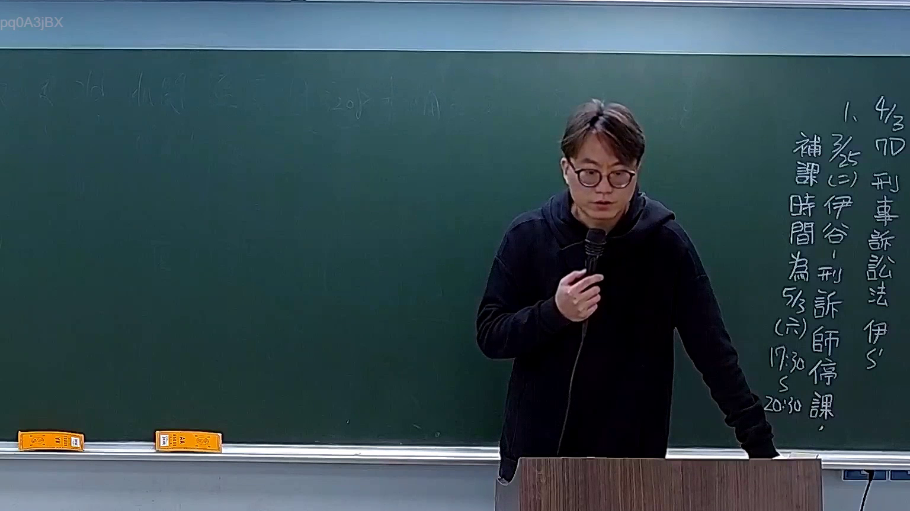

# 🎥 影音教材板書校對筆記
    - **來源影片**: [預約 34 2025-04-08 09-39-33-603](file:///J:///刑訴B///ch34///預約 34 2025-04-08 09-39-33-603.mp4)
    - **課程分類**: `[刑訴B`
    - **課堂章節**: `ch34]`
    - **影片時間戳記**: `00:01:30` (90 秒)
    - **板書類型**: `影音板書`
    - **偵測時間**: 2026-08-07 20:14:14
    
    ## 🔍 擷取黑板板書對照圖
    
    
    ## 🧠 AI 智慧理解與知識庫演化註記
    ：
這張板書內容主要為課程行政公告，而非直接的法律條文或學理討論。它詳細列出了關於「刑事訴訟法」課程的補課資訊。

1.  **辨識文字與符號**：
    *   右上角標題或編號：`1、4/3`
    *   課程名稱與老師：`四 刑事訴訟法 伊老師` (這裡的「伊S'」經判斷應為「伊老師」)
    *   停課訊息：`補課 3/25 (二) 伊谷-刑訴師停課,`
    *   補課時間：`時間 為 5/3 (六) 17:30 ~ 20:30 課,`

2.  **板書詳細解讀與法條對照**：
    板書所示為一堂由「伊谷老師」教授的「刑事訴訟法」課程的停課與補課通知。
    *   `1、4/3`：這可能是一個課程編號或公告序號，其中「4/3」可能代表與4月3日相關的某個資訊，例如原定課程日期或某個重要日期參考點。
    *   `四 刑事訴訟法 伊老師`：明確指出這是「刑事訴訟法」課程，授課老師為「伊老師」（或「伊谷老師」）。前方的「四」可能表示課程的班級、系列編號或是星期四的課程（但後續停課發生在星期二，補課在星期六，因此「四」更可能是課程代碼或序號）。
    *   `補課 3/25 (二) 伊谷-刑訴師停課,`：公告指出，因故在「3月25日（星期二）」當天，由「伊谷老師」教授的「刑事訴訟師」課程（即刑事訴訟法）已停課。
    *   `時間 為 5/3 (六) 17:30 ~ 20:30 課,`：由於課程停課，因此安排了補課。補課時間訂於「5月3日（星期六）的下午17:30至晚上20:30」。

    **法律學理與法條對照**：
    雖然板書本身是行政公告，但其核心內容涉及「**刑事訴訟法**」這門專業法律學科。
    *   **刑事訴訟法**：是規範國家追訴、審判、執行犯罪過程的法律。它旨在保障國家刑罰權的適當行使，同時也肩負著保障人權、確保程序正義的重要功能。相對於民法（私法，規範私人間權利義務），刑事訴訟法屬於公法，涉及國家公權力與公民基本權利的平衡。
    *   **爭點/關係**：此板書未呈現法律上的爭點或案例，純粹為課程安排公告。因此，無法直接對照如民法第184條（侵權行為）、消滅時效等實體法條文。其主要關係是課程與授課老師、停課事件與補課安排的行政流程關係。
    *   **演化註記**：在臺灣的法律教育體系中，刑事訴訟法是法律系學生的核心必修科目，涵蓋偵查、起訴、審判、上訴及執行等各階段的程序規定。學生需要學習各種程序原則，例如無罪推定原則、直接審理原則、言詞辯論原則等，並熟悉刑事訴訟法典的具體條文，以理解國家如何合法且公正地追訴犯罪，同時保障被告的訴訟權益。此課程的重要性在於它是銜接刑法實體規範與司法實務運作的橋樑。
    
    ## 📊 可編輯之 Mermaid 關係流程圖
    ```mermaid
    ：
graph TD
    A["課程公告 1"] --> B["課程名稱與教師"]
    B --> C["刑事訴訟法"]
    B --> D["伊谷老師"]
    C --> E["3月25日停課原因"]
    D --授課老師--> E
    E --> F["原訂3月25日(二)停課"]
    F --> G["需進行補課安排"]
    G --> H["補課時間"]
    H --> I["5月3日(六) 1730-2030"]
    ```
    
    ## ✍️ 操作者手動校對修改區
    <!-- 您可以直接修改上方的文字或調整 Mermaid 區塊中的節點，Obsidian 會即時重新渲染 -->
    - [ ] 欄位結構與法律邏輯已校對無誤。
    - **校對筆記**: 
    