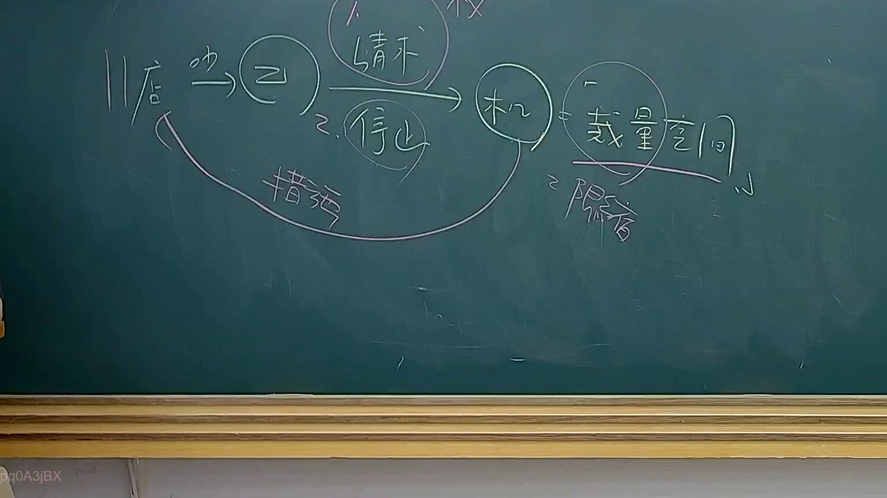

# 🎥 影音教材板書校對筆記
    - **來源影片**: [預約 34 2025-08-07 08-14-49-946](file:///J:/行政法A/ch34/預約 34 2025-08-07 08-14-49-946.mp4)
    - **課程分類**: `[行政法A`
    - **課堂章節**: `ch34]`
    - **影片時間戳記**: `00:40:00` (2400 秒)
    - **板書類型**: `影音板書`
    - **偵測時間**: 2026-07-22 03:18:19
    
    ## 🔍 擷取黑板板書對照圖
    
    
    ## 🧠 AI 智慧理解與知識庫演化註記
    ：
這張板書圖示呈現的是行政法中極為重要的「裁量收縮至零」（Ermessensreduzierung auf Null）理論，以及受害人民對行政機關的「公法上權利」行使邏輯。

1. **板書文字 OCR 與關係辨識**：
   - **店 / 吵**：位於最左側，代表干擾源（例如商店、工廠或工地）產生了「噪音」或「侵害行為」（板書以「吵」字簡略代表）。
   - **乙**：圓圈中的乙代表受害人（鄰人或受侵害之第三人）。
   - **1. 請求 / 2. 停止**：箭頭指向行政機關，代表乙依據公法規定，向機關提出「行政處分請求權」，要求機關行使公權力命令店方「停止」侵害。
   - **机（機關）**：圓圈中的「机」是「行政機關」的速記符號。
   - **裁量空間 / 限縮**：機關在處理行政事務時通常享有裁量權，但在特定情況下（如侵害生命、身體、健康權益嚴重時），該裁量空間會「限縮」至零，此時機關不再有「做或不做」的自由。
   - **措施**：下方的曲線回溯至店方，代表機關受限縮後，必須採取具體的「行政措施」（如勒令停業、罰鍰或強制拆除）。

2. **法律學理與條文對照**：
   - **裁量收縮至零與保護規範理論**：本圖體現了司法院釋字第 469 號解釋的精神。當法律規定之目的在於保護特定人民之私益（而不僅是公益），且人民權益受損嚴重，行政機關本於職權應作為而不作為時，人民具有「法律上之利益」可請求機關作為。
   - **行政程序法第 7 條（比例原則）**：機關採取的「措施」必須符合適當性、必要性及衡量性。
   - **行政訴訟法第 5 條（課予義務訴訟）**：若「乙」向「機關」請求停止噪音受拒，或機關怠於執行，乙可依法提起「課予義務訴訟」，請求法院判命機關作成特定處分。
   - **國家賠償法第 2 條第 2 項（後段）**：若機關在裁量收縮至零的情況下，仍故意或過失怠於執行職務（不採取措施），導致人民自由或權利遭受損害，人民可請求國家賠償。
    
    ## 📊 可編輯之 Mermaid 關係流程圖
    ```mermaid
    ：
graph LR
    A["店 (行為人)"] -- "產生噪音 (吵)" --> B["受害人乙"]
    B -- "1. 請求 / 2. 停止" --> C["行政機關 (机)"]
    C -- "法定職權" --> D["裁量空間"]
    D -- "嚴重侵害時" --> E["限縮 (裁量收縮至零)"]
    E -- "強制執行" --> F["法律措施"]
    F -.-> A["命令店方停止侵害"]

    style E fill#f9f,stroke#333,stroke-width2px
    style C fill#bbf,stroke#333,stroke-width2px
    ```
    
    ## ✍️ 操作者手動校對修改區
    <!-- 您可以直接修改上方的文字或調整 Mermaid 區塊中的節點，Obsidian 會即時重新渲染 -->
    - [ ] 欄位結構與法律邏輯已校對無誤。
    - **校對筆記**: 
    