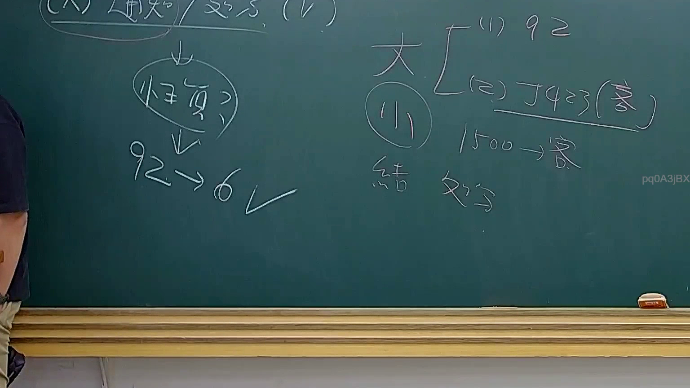

# 🎥 影音教材板書校對筆記
    - **來源影片**: [預約 34 2025-08-07 08-14-49-946](file:///J:/行政法A/ch34/預約 34 2025-08-07 08-14-49-946.mp4)
    - **課程分類**: `[行政法A`
    - **課堂章節**: `ch34]`
    - **影片時間戳記**: `01:02:30` (3750 秒)
    - **板書類型**: `影音板書`
    - **偵測時間**: 2026-07-22 03:18:44
    
    ## 🔍 擷取黑板板書對照圖
    
    
    ## 🧠 AI 智慧理解與知識庫演化註記
    ：
1. 板書文字高精度 OCR 辨識：
   - 左側上方：(A) 通知 / 處分 (V)
   - 左側向下箭頭與圓圈：性質？
   - 左側下方推導：92 -> 6 (打勾)
   - 右側上方大括號：
     - (1) 92
     - (2) J423 (臺)
   - 右側中間：1500 -> 案
   - 右側下方：結 処分

2. 詳細法律理解說明與條文對位：
   - 本板書主要涉及行政法學上關於「行政處分」與「觀念通知」之性質辨別，以及實務見解（如最高行政法院判例或大法官解釋、最高行政法院決議等）之操作邏輯。
   - 關於「通知 / 處分 (V)」與「性質？」，顯示老師在帶領學生辨識特定公部門之意思表示究係直接對外發生法律效果之行政處分（行政程序法第92條），抑或是僅屬事實敘述或理由說明之觀念通知。
   - 涉及條文與實務見解：
     - 《行政程序法》第92條第1項：本法所稱行政處分，係指行政機關就公法上具體事件所為之決定或其他公權力措施而對外直接發生法律效果之單方行政行為。
     - 提到的「J423」可能指司法院大法官釋字第423號解釋（針對行政處分之概念與救濟途徑）或其他相關實務裁判字號。
     - 數字「1500」、「92 -> 6」等可能為特定裁判字號（如最高行政法院年度判字或裁字）或條項文號之板書縮寫速記，用以說明行政處分成立要件或訴訟標的之歸類。
    
    ## 📊 可編輯之 Mermaid 關係流程圖
    ```mermaid
    ：
graph TD
    A["公部門意思表示"] --> B{"性質辨別"}
    B --> C["行政處分 (行政程序法§92)"]
    B --> D["觀念通知 / 事實行為"]
    C --> E["具體事件對外發生法律效果"]
    D --> F["不直接生法律效果"]
    C --> G["救濟途徑：訴願與行政訴訟"]
    ```
    
    ## ✍️ 操作者手動校對修改區
    <!-- 您可以直接修改上方的文字或調整 Mermaid 區塊中的節點，Obsidian 會即時重新渲染 -->
    - [ ] 欄位結構與法律邏輯已校對無誤。
    - **校對筆記**: 
    