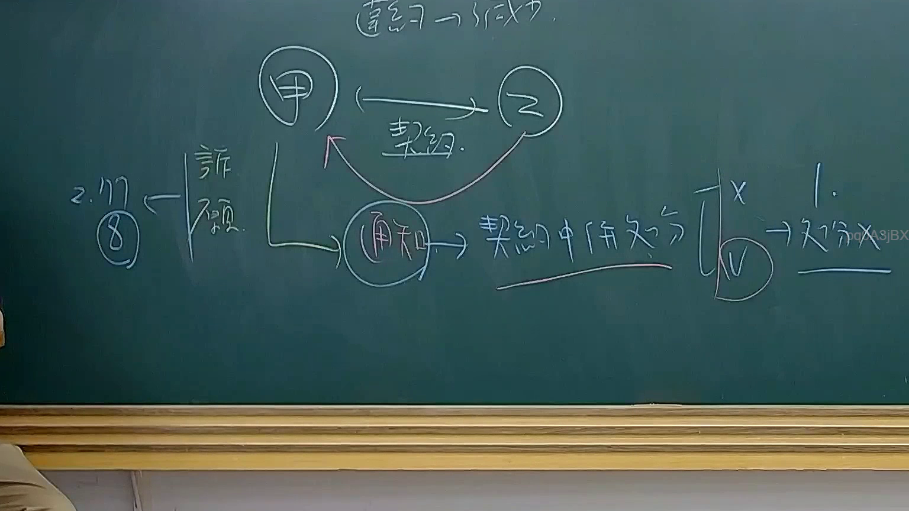

# 🎥 影音教材板書校對筆記
    - **來源影片**: [預約 34 2025-08-07 08-14-49-946](file:///J:/行政法A/ch34/預約 34 2025-08-07 08-14-49-946.mp4)
    - **課程分類**: `[行政法A`
    - **課堂章節**: `ch34]`
    - **影片時間戳記**: `01:25:45` (5145 秒)
    - **板書類型**: `影音板書`
    - **偵測時間**: 2026-07-22 03:18:55
    
    ## 🔍 擷取黑板板書對照圖
    
    
    ## 🧠 AI 智慧理解與知識庫演化註記
    ：
1. 【板書高精度 OCR】：
   - 頂部：締結 $\rightarrow$ 不成立
   - 核心當事人：甲、乙
   - 中間關係：甲與乙之間有「契約」關係，乙向甲發出「通知」，進而影響「契約中併生效分」（或相關法律效力分派）。
   - 左側側標：2.17 / 8 / 詐欺 $\rightarrow$ 牽涉民法第 92 條意思表示不自由（詐欺）或相關撤銷權之行使。
   - 右側邏輯判斷：打叉(X)與打勾(V)的分支對照 $\rightarrow$ 1. $\rightarrow$ 不分 (或特定法律效果之區分)。

2. 【板書詳細解讀與法條對照】：
   - 本板書探討的核心在於「契約締結過程中的瑕疵」與「意思表示錯誤、詐欺或通知效力」之法律爭點。
   - 相關法條對照：
     - **民法第 153 條**（契約之成立）：當事人互相表示意思一致者，無論其為明示或默示，契約即為成立。板書上方提到「締結 $\rightarrow$ 不成立」，即指契約因意思表示未合致而未成立。
     - **民法第 92 條**（因被詐欺或被脅迫而為意思表示）：因被詐欺或被脅迫而為意思表示者，表意人得撤銷其意思表示。板書左側註記「詐欺」與數字「2.17」，推測為相關實務見解、條文項次或上課案例編號。
     - **意思表示通知與生效**：當事人一方發出通知（如撤銷意思表示、解除契約或承認之通知），到達相對人時發生效力（民法第 95 條），進而影響整體契約關係之存續與法律效果之分派（板書右側之打勾打叉與效果區分）。
    
    ## 📊 可編輯之 Mermaid 關係流程圖
    ```mermaid
    ：
graph TD
    A["甲"] <-->|"契約"| B["乙"]
    A -->|"通知"| C["契約中併生效分"]
    D["2.17 詐欺"] -.->|"影響"| A
    C --> E["X 方案"]
    C --> F["V 方案"]
    F --> G["1. 不分"]
    ```
    
    ## ✍️ 操作者手動校對修改區
    <!-- 您可以直接修改上方的文字或調整 Mermaid 區塊中的節點，Obsidian 會即時重新渲染 -->
    - [ ] 欄位結構與法律邏輯已校對無誤。
    - **校對筆記**: 
    