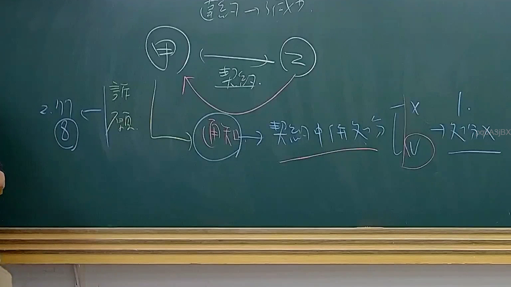

# 🎥 影音教材板書校對筆記
    - **來源影片**: [預約 34 2025-08-07 08-14-49-946](file:///J:/行政法A/ch34/預約 34 2025-08-07 08-14-49-946.mp4)
    - **課程分類**: `[行政法A`
    - **課堂章節**: `ch34]`
    - **影片時間戳記**: `01:26:15` (5175 秒)
    - **板書類型**: `影音板書`
    - **偵測時間**: 2026-07-22 03:19:05
    
    ## 🔍 擷取黑板板書對照圖
    
    
    ## 🧠 AI 智慧理解與知識庫演化註記
    ：
1. 【板書高精度 OCR】：
   - 頂部：締結 $\rightarrow$ 不成立
   - 主體關係：甲、乙之間有「契約」關係。
   - 下方流程：甲 $\rightarrow$ 透過「通知」$\rightarrow$ 「契約中併列 $\ldots$」 $\rightarrow$ 分為「$X$」與「$V$（打勾）」兩種情形。
   - 左側註記：2.17 / 數字 8 / 「許願」
   - 右側註記：1. / 處分 $X$

2. 【詳細法律理解與條文對位】：
   - 本板書探討的法律爭點涉及契約之締結、意思表示不一致或契約不成立時的法律效果，以及相關的通知義務與處分權限。
   - 在臺灣民法架構下，契約之成立須有要約與承諾之合致（民法第153條）。若當事人間就必要之點意思表示不一致，則契約不成立。
   - 板書中呈現當甲乙進行交涉或締約時，若發生契約不成立的情況，後續透過「通知」以及在契約中併列條款的處理方式，並區分出可行（$V$）與不可行（$X$）的法律效果與處分限制。
    
    ## 📊 可編輯之 Mermaid 關係流程圖
    ```mermaid
    ：
graph TD
    A["甲"] -->|契約| B["乙"]
    A -->|"通知"| C["契約中併列處分"]
    C --> D["X"]
    C --> E["V"]
    D --> F["1. 不處分"]
    G["締結"] --> H["不成立"]
    I["2.17"] --> J["8"]
    J --> K["許願"]
    ```
    
    ## ✍️ 操作者手動校對修改區
    <!-- 您可以直接修改上方的文字或調整 Mermaid 區塊中的節點，Obsidian 會即時重新渲染 -->
    - [ ] 欄位結構與法律邏輯已校對無誤。
    - **校對筆記**: 
    