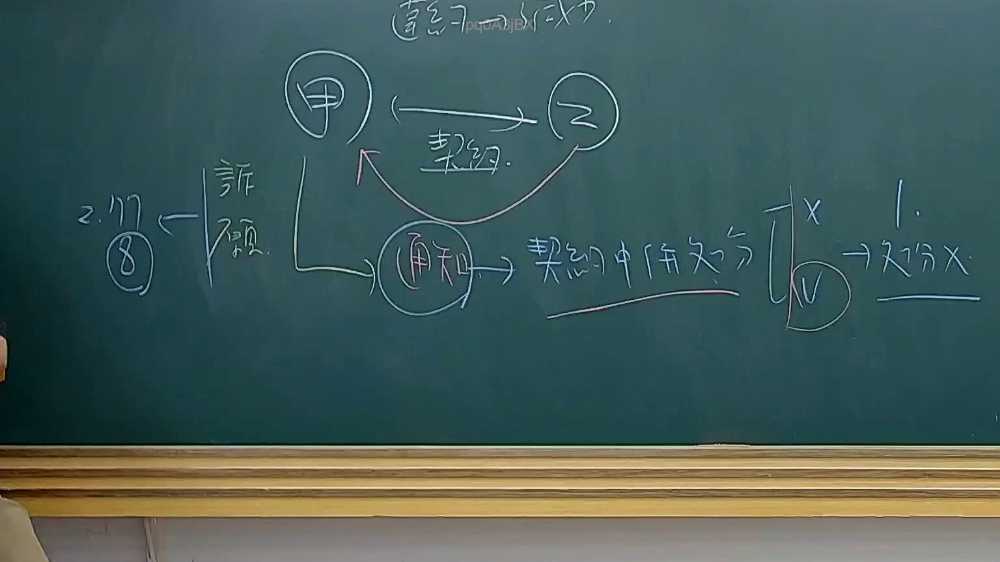

# 🎥 影音教材板書校對筆記
    - **來源影片**: [預約 34 2025-08-07 08-14-49-946](file:///J:/行政法A/ch34/預約 34 2025-08-07 08-14-49-946.mp4)
    - **課程分類**: `[行政法A`
    - **課堂章節**: `ch34]`
    - **影片時間戳記**: `01:27:45` (5265 秒)
    - **板書類型**: `影音板書`
    - **偵測時間**: 2026-07-22 03:19:15
    
    ## 🔍 擷取黑板板書對照圖
    
    
    ## 🧠 AI 智慧理解與知識庫演化註記
    ：
1. 板書文字與結構辨識：
   - 頂部：契約之成立
   - 核心主體：甲與乙之間存有「契約」關係。
   - 法律程序與行為：甲向乙為「通知」，進而牽涉到「契約中併生效分」之爭點。
   - 左側註記：提及「詐顯」（詐欺顯失公平或類似撤銷/解除權行使），並有「2. 177 ⑧」（可能對應民法第177條第8項或相關條號）以及訴願/訴訟相關脈絡。
   - 右側結論：呈現選項或見解的分歧，標示有「X」、「V」與「1. -> 部分 X」。

2. 法律學理與法條對照：
   - 本板書主要探討契約成立後的效力、意思表示之通知與瑕疵（如詐欺、顯失公平），以及行使撤銷權或解除權時的法律效果與範圍分界。
   - 相關適用法條包含《民法》第92條（因詐欺或脅迫而為意思表示之撤銷）、第177條（不法管理或無因管理相關規定）以及契約解除與一部無效/一部撤銷之法理。
    
    ## 📊 可編輯之 Mermaid 關係流程圖
    ```mermaid
    ：
graph TD
    A["甲"] -->| "契約" | B["乙"]
    A -->| "通知" | C["契約中併生效分"]
    C -->| "實體見解" | D["X"]
    C -->| "實體見解" | E["V"]
    E -->| "結論" | F["1. 部分X"]
    G["2. 177 8"] -->| "涉詐顯" | A
    ```
    
    ## ✍️ 操作者手動校對修改區
    <!-- 您可以直接修改上方的文字或調整 Mermaid 區塊中的節點，Obsidian 會即時重新渲染 -->
    - [ ] 欄位結構與法律邏輯已校對無誤。
    - **校對筆記**: 
    